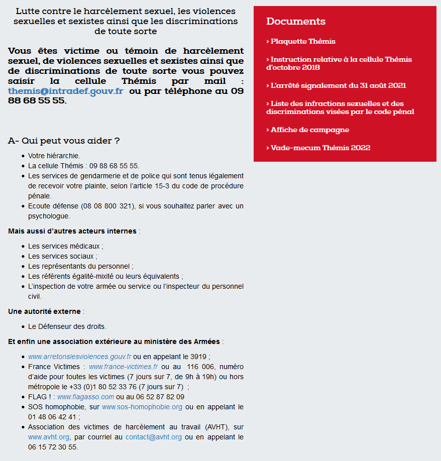

          

# Rapport de connaissances métier sur le harcèlement en entreprise

Réalisé par Julien Giraud 11704709.

## Sommaire

- [Rapport de connaissances métier sur le harcèlement en entreprise](#rapport-de-connaissances-métier-sur-le-harcèlement-en-entreprise)
  - [Sommaire](#sommaire)
  - [Remerciements](#remerciements)
  - [Origines](#origines)
  - [Définitions](#définitions)
    - [Harcèlement moral](#harcèlement-moral)
    - [Harcèlement sexuel](#harcèlement-sexuel)
  - [Protection des salariés](#protection-des-salariés)
    - [Document Unique d'Évaluation des Risques Professionnels (DUERP)](#document-unique-dévaluation-des-risques-professionnels-duerp)
    - [Recours possibles pour la victime](#recours-possibles-pour-la-victime)
  - [Différents points de vue](#différents-points-de-vue)
    - [Point de vue du chargé de prévention](#point-de-vue-du-chargé-de-prévention)
    - [Point de vue de la victime](#point-de-vue-de-la-victime)
    - [Point de vue du harceleur](#point-de-vue-du-harceleur)
  - [Évolution des points de vue](#évolution-des-points-de-vue)
  - [Actualité](#actualité)
  - [Conclusion](#conclusion)
  - [Références](#références)
  - [Annexe](#annexe)
    - [Plaquette de prévention diffusée au Centre Ministériel de Gestion de Lyon](#plaquette-de-prévention-diffusée-au-centre-ministériel-de-gestion-de-lyon)

## Remerciements

Je tiens à remercier Nelly Windisch, Chargée de missions RH et SST au Centre Ministériel de Gestion de Lyon ; pour le temps qu'elle m'a consacré dans le but de parler du harcèlement en entreprise du point de vue prévention. Son témoignage m'a donné beaucoup de pistes à explorer pour la réalisation de ce rapport à la fois sur ce qui caractérise le harcèlement et sur les moyens existants pour le combattre.

## Origines

Que ce soit au travail ou dans la vie quotidienne, le harcèlement tel qu'on le défini aujourd'hui a toujours existé. À l'échelle du droit français c'est une préoccupation relativement récente. Les premiers articles de loi liés à ce problème sont mis en vigueur en 1994 mais il faut attendre jusqu'aux alentours de 2010 avant que l'infraction soit définie de façon suffisamment claire pour permettre en théorie une protection efficace des victimes.

## Définitions

Aux yeux de la loi on distingue deux types de harcèlement, le harcèlement moral et le harcèlement sexuel. Dans les deux cas il en résulte une dégradation des conditions de travail du salarié.

### Harcèlement moral

En entreprise le harcèlement moral d'un salarié est définit par des « agissements répétés [...] qui ont pour objet ou pour effet une dégradation de ses conditions de travail susceptible de porter atteinte à ses droits et à sa dignité, d'altérer sa santé physique ou mentale ou de compromettre son avenir professionnel » (article L1152-1 du Code du travail, version en vigueur depuis le 1er mai 2008).

Une charge de travail ou une pression trop importante qui se traduit par un environnement de travail malsain est également considéré comme une forme de harcèlement.

### Harcèlement sexuel

« Le harcèlement sexuel est le fait d'imposer à une personne, de façon répétée, des propos ou comportements à connotation sexuelle ou sexiste qui soit portent atteinte à sa dignité en raison de leur caractère dégradant ou humiliant, soit créent à son encontre une situation intimidante, hostile ou offensante » (article 222-33 du Code pénal, version en vigueur depuis le 6 août 2018).

La notion d' « agissements répétés » n'est pas nécessaire lorsque plusieurs personnes agissent séparément à l'encontre d'un même salarié, ou en cas de « pression grave [...] exercée dans le but réel ou apparent d'obtenir un acte de nature sexuelle, que celui-ci soit recherché au profit de l'auteur des faits ou au profit d'un tiers » (article 1153-1 du Code du travail, version en vigueur depuis le 31 mars 2022).

## Protection des salariés

Aujourd'hui il existe différents systèmes permettant de protéger les salariés du harcèlement.

### Document Unique d'Évaluation des Risques Professionnels (DUERP)

Il est de la responsabilité de l'employeur de veiller à la sécurité et à la santé des salariés. Dans cette optique, depuis novembre 2001 le droit du travail exige aux entreprises de réaliser un DUERP dès l'embauche du premier salarié. Il s'agit d'un document qui référence le résultat de l'évaluation des risques pour la santé et la sécurité auxquels peuvent être exposés les salariés, ce qui inclut le harcèlement sexuel depuis 2014 dans le cadre de la loi pour l’Égalité réelle, du 4 août 2014. Ce document est consultable par tous les salariés de l'entreprise.

Pour la réalisation de ce document, l'employeur doit effectuer des entretiens avec les salariés afin d'analyser leurs conditions de travail. Les conditions d'emploi, les conditions liées à l'organisation du travail et les conditions liées au dialogue avec les autres salariés doivent aussi être prises en compte. Les résultats de cette analyse doivent être accompagnés de proposition d'actions de prévention qui sont transmises à la Médecine du travail, à la Caisse d'assurance retraite et de la santé au travail (Carsat) et à l'Inspection du travail.

### Recours possibles pour la victime

En interne il faut dans la mesure du possible en parler avec son supérieur ou avec le chargé de prévention s'il y en a un. En cas de problème avec la hiérarchie il faut essayer de s'adresser à des personnes de confiance et aux autres chefs. Les représentants du personnel peuvent aussi aider à réaliser des démarches et s'il y a un Comité Social et Économique (CSE), il dispose d'un droit d'alerte pour prévenir l'employeur du problème.

Lorsque l'employeur ne vient pas en aide au salarié ou que la situation est trop compliquée il est possible de porter plainte, dans ce cas il faut constituer un ensemble de preuves afin obtenir gain de cause. Pour obtenir un soutien au pénal il est possible de contacter le syndicat de l'entreprise syndicat ou celui du corps de métier s'il n'y en a pas. Il ne faut pas hésiter à alerter la Médecine du travail pour obtenir un certificat médical qui atteste des conséquences du harcèlement sur la santé du salarié, il s'agit d'une preuve recevable. Les témoignages des collègues, les mails, les messages ou les enregistrements permettent également de compléter l'ensemble de preuves.

Malheureusement parfois (voire souvent) la seule solution est de démissionner afin de ne plus travailler dans une atmosphère néfaste.

## Différents points de vue

### Point de vue du chargé de prévention

L'un des rôles du chargé de prévention est de prévenir les salariés. Cette étape passe généralement par une campagne de sensibilisation (voir annexe [Plaquette de prévention diffusée au Centre Ministériel de Gestion de Lyon](#plaquette-de-prévention-diffusée-au-centre-ministériel-de-gestion-de-lyon)). Ensuite il doit communiquer avec eux afin de vérifier s'ils vont bien. Cette étape est compliquée car généralement ils ne le disent pas. Pour obtenir ce type d'information il faut créer un lien avec eux, ce qui passe par des échanges réguliers lors desquels le chargé de prévention pose discrètement quelques questions. Il est aussi possible de mettre en place des cellules d'écoute anonymes ou d'ouvrir des groupes de parole.

Lorsque qu'il est au courant d'un problème de harcèlement, il doit en discuter avec la victime et il a l'obligation de faire remonter l'information sans quoi il s'expose à des poursuites judiciaires. Faire parler la victime est souvent compliqué et faire remonter l'information est délicat car beaucoup de victimes ne souhaite pas qu'elle soit divulguée.

Dans certains cas le fait de demander au harceleur de cesser ses agissements est suffisant pour résoudre le problème. Il peut s'agir de remarques déplacées ou d'un manager qui exige qu'un alternant réalise la même quantité de travail qu'un salarié avec 10 années d'expérience. Il est aussi possible de faire évoluer la fiche de poste pour réduire la charge de travail, travailler sur d'autres problématiques ou pour minimiser les contacts avec un harceleur et éventuellement des collègues qui ont assisté aux actes de harcèlement sans réagir.

### Point de vue de la victime

*todo*
La victime :
- a du mal à communiquer
- peut ne pas avoir conscience d'être harcelée
- peut être amenée à penser que le problème vient d'elle
- se sent rabaissée, humiliée
- n'ose pas en parler
- a peur
- ne sait pas à qui elle peut se confier
- a l'impression que personne ne souhaite l'aider
- ne veut pas que ça se sache
- espère que c'est temporaire et que la situation va redevenir normale

### Point de vue du harceleur

*todo*
- Le harceleur n'a pas forcément l'impression de nuire, de son point de vue il peut avoir un comportement tout à fait normal. Les problèmes de perceptions différentes sont l'une des raisons pour lesquels il est difficile de prouver un cas de harcèlement.

## Évolution des points de vue

Au niveau du code pénal, le premier type de harcèlement en entreprise considéré comme une infraction est le harcèlement sexuel, article 222-33 du 1er mars 1994. Dans ses premières versions, la définition du harcèlement n'était pas clairement donnée et la peine était d'un an d'emprisonnement ainsi que de 100 000 F d'amende, soit 1 500 €. Ce n'est qu'à partir de 2012 que la définition du harcèlement sexuel devient explicite. La peine est doublée, voire triplée dans certains cas définis par les dernières versions de l'article. Enfin, à partir de 2018 le sexisme est clairement rajouté dans les comportements qui caractérisent le harcèlement (voir définition du [Harcèlement sexuel](#harcèlement-sexuel)).  
Dans le droit du travail, la protection commence à partir de 2008 pour le harcèlement moral et sexuel. On observe le même phénomène, plus la version de l'article est récente plus la définition du harcèlement est précise (voir article L1153-1 du Code du travail, version 2008, 2012 et 2022). Il en est de même pour le DUERP qui considère le harcèlement comme un risque pour la santé à partir de 2014.

On observe une évolution positive des textes de loi qui protègent les travailleurs du harcèlement, à la fois par l'arrivée de nouveaux textes, par la précision des textes existants qui leur permet de protéger plus de situations et par l'alourdissement des peines. Ces évolutions montrent que la lutte contre le harcèlement est devenu de plus en plus prioritaire au cours des dernières années.

## Actualité

Entre 2008 et 2009 les syndicats et la direction de France Telecom, Orange depuis 2013, recense 35 suicides parmi les salariés. Une tragédie qui a été causée par le harcèlement moral des salariés dans le cadre d'une suppression massive de postes sans licenciements. France Telecom a été condamné pour harcèlement moral en décembre 2019.

En mars 2022 un salarié de Pôle emploi obtient gain de cause au Prod'homme après avoir été harcelé moralement pendant 5 ans par sa supérieur hiérarchique. Le salarié a été volontairement isolé et surveillé à son insu de nombreuses fois. Il a informé sa hiérarchie du problème à de multiples reprises sans réaction de la part de celle-ci. Plusieurs de ses collègues ont témoigné en sa faveur ce qui a permis d'appuyer sa plainte.

Ce type d'affaires ne sont pas des cas isolés mais il est rare qu'une victime obtienne gain de cause. Des études réalisées en 2019 par l'Institut national d'études démographiques (Ined) et l'Institut d'études opinion et marketing en France et à l'international (Ifop) ont révélé que 15 à 30 % des travailleurs français sont victimes de harcèlement ou de violences avec une proportion élevée de femmes. Seulement 30 % des victimes ont communiqué l'information à leur employeur et parmi elles 40 % estiment que le problème n'a pas été réglé en leur faveur (voir article sur les violences et le harcèlement dans le monde du travail). Ces données montrent qu'en 2019, moins de 20 % des victimes de violences ou de harcèlement au travail ont pu favorablement résoudre leur problème.

## Conclusion

Le harcèlement en entreprise est un problème d'actualité. Qu'il s'agisse de harcèlement moral ou sexuel, il existe différents dispositifs permettant de le prévenir et d'aider les victimes à le combattre. Malheureusement les situations sont souvent complexes, ambiguës et les perceptions sont différentes d'une personne à l'autre. En pratique, la plupart des victimes ne communiquent pas leurs problèmes. Lorsqu'elles le font, il est difficile d'apporter des preuves recevables et la situation n'est pas résolue de façon satisfaisante dans 2 cas sur 5.

## Références

- [Document sur les étapes à mettre en place pour le DUERP dans le cadre d'un webinaire de l'Agence nationale pour l'amélioration des conditions de travail (Anact)](https://www.dossierfamilial.com/emploi/conditions-de-travail/harcelement-moral-au-travail-adopter-les-bons-reflexes-428394).

- [Page du site Service Public sur le harcèlement moral au travail](https://www.service-public.fr/particuliers/vosdroits/F2354).

- [Article sur les pratiques considérées comme du harcèlement par la loi](https://www.justifit.fr/b/guides/droit-travail/harcelement-au-travail-identification-preuve/).

- [Article de la CFDT sur le harcèlement au travail](https://www.cfdt.fr/portail/vos-droits/droits-fondamentaux-et-protection-des-salaries/harcelement/le-harcelement-au-travail-rec_66679).

- [Article sur le DUERP](https://www.espace-cssct.fr/toutes-les-actualites-du-chsct/cse-le-document-unique-d-evaluation-des-risques-professionnels-duerp-est-il-obligatoire).

- [Article 222-33 du Code pénal sur le harcèlement sexuel](https://www.dalloz.fr/documentVersions?productCode=CPEN&docEtiq=CODE_CPEN_ARTI_222-33&versionId=LEGIARTI000037289662).

- [Article 222-33-2 du Code pénal sur le harcèlement moral](https://www.dalloz.fr/documentVersions?productCode=CPEN&docEtiq=CODE_CPEN_ARTI_222-33-2&versionId=LEGIARTI000029336939).

- [Article L1152-1 du Code du travail sur le harcèlement moral](https://www.legifrance.gouv.fr/codes/article_lc/LEGIARTI000006900818/).

- [Article L1153-1 du Code du travail sur le harcèlement sexuel](https://www.dalloz.fr/documentation/Document?id=CTRA132040&scrll=CTRA214338).

- [Article sur les preuves du harcèlement au travail](https://www.estim-formation.com/dossiers-droit-ressources-humaines/5-preuves-possibles-pour-prouver-harcelement-travail).

- [Article sur la condamnation de Pôle emploi](https://www.capital.fr/entreprises-marches/surveille-isole-un-employe-fait-condamner-pole-emploi-pour-harcelement-moral-aux-prudhommes-1436463).

- [Page Wikipedia sur l'affaire France Telecom](https://fr.wikipedia.org/wiki/Affaire_France_T%C3%A9l%C3%A9com).

- [Article sur les violences et le harcèlement dans le monde du travail en France suite à la convention n° 190 de l'Organisation internationale du travail](https://www.editions-tissot.fr/actualite/sante-securite/violence-et-harcelement-dans-le-monde-du-travail-la-convention-ndeg-190-de-l-oit-a-t-elle-un-impact-en-entreprise).

## Annexe

### Plaquette de prévention diffusée au Centre Ministériel de Gestion de Lyon

