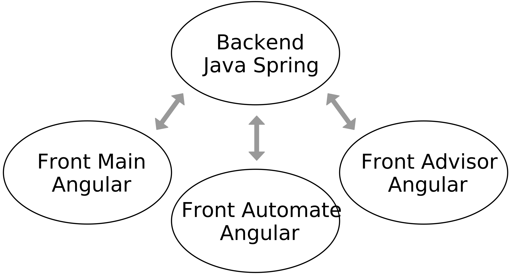
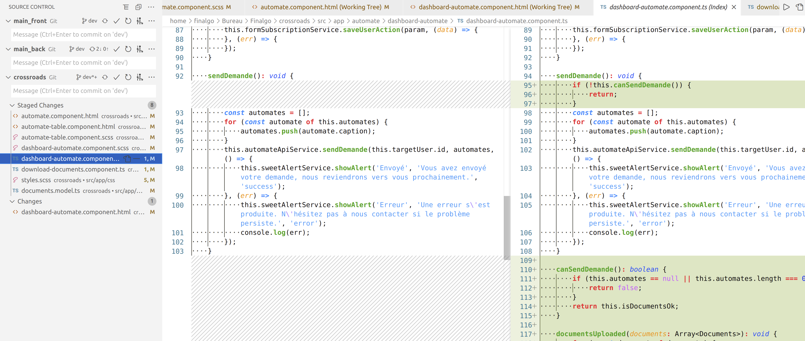

# Rapport final d'alternance

Ce document est un brouillon du rapport final.

## Page de garde

Titre :

> Rapport d'alternance  
> développeur full stack  
> chez Finalgo

Petit encadré sur les deux dernières lignes du titre ?

Bloc "réalisé par / tuteurs"

> Réalisé par : Julien Giraud  
> Diplôme préparé : Master 2 Informatique  
> Tuteur entreprise : Bertrand Héllion  
> Tuteur pédagogique : Marc Plantevit  
> Durée : du 06/09/2021 au 31/08/2022 (1 an)

## Remerciements

Je tiens à remercier Bertrand Hellion de m'avoir accepté à Finalgo et accompagné au cours des deux dernières années. Je remercie Lionel Médini d'avoir été mon tuteur cette année. Je remercie également toute l'équipe Finalgo ainsi que les dernières générations de stagiaires et alternants pour moments passés ensemble.

## Table des matières

- [Rapport final d'alternance](#rapport-final-dalternance)
  - [Page de garde](#page-de-garde)
  - [Remerciements](#remerciements)
  - [Table des matières](#table-des-matières)
  - [Introduction](#introduction)
  - [Présentation de Finalgo](#présentation-de-finalgo)
    - [L'équipe](#léquipe)
    - [Les projets](#les-projets)
  - [Environnement de travail](#environnement-de-travail)
    - [Matériel et lieu](#matériel-et-lieu)
    - [Outils et logiciels](#outils-et-logiciels)
      - [Slack](#slack)
      - [Asana](#asana)
      - [Google Workspace](#google-workspace)
      - [Gather](#gather)
  - [Environnement technique](#environnement-technique)
    - [Côté serveur](#côté-serveur)
    - [Côté client](#côté-client)
    - [Outils de développement](#outils-de-développement)
  - [Missions effectuées](#missions-effectuées)
  - [Conclusion](#conclusion)

## Introduction

Dans le cadre de mon Master Informatique à l'UCBL j'ai opté pour un cursus en alternance au sein de Finalgo, une startup locale spécialisée dans les applications web en lien avec les financements.

J'ai pu effectuer cette alternance suite à mon stage optionnel de L3 réalisé au même endroit. Pour celle-ci, un contrat d'apprentissage de deux ans a été signé. Cette période correspond à un Master qui se termine par un diplôme dans les Technologies de l'Information et Web (TIW).

Les notions vues en cours lors de mon DUT, de ma Licence 3 et tout au long du Master ainsi que mes précédentes expériences professionnelles m'ont beaucoup aidé à réaliser mes missions en entreprise.

Certaines missions ont renforcé mes connaissances, d'autres m'ont permi de comprendre des éléments abordés au cours de l'année dans un cadre professionnel.

Tout au long de l'année j'ai réalisé des missions diverses au sein de Finalgo, principalement dans le but de réduire la dette technique et améliorer les performances de nos applications.

## Présentation de Finalgo

Finalgo est une startup familiale de 8 collaborateurs spécialisée dans la recherche de financements 100 % digitale et la construction et la gestion de dossiers de financement.

Notre vocation est de faciliter l'accès au financement pour les entrepreneurs, artisans, commerçants et plus généralement aux dirigeants de TPE / PME.

Nous proposons à nos clients trois plateformes web en SaaS\* qui répondent à ces besoins. La première est un outil de gestion pour les professionnels de la finance, elle permet de construire et gérer des dossiers de financement et fonctionne sous forme d'abonnements payants. La deuxième est à destination des dirigeants de PME, elle permet de rechercher gratuitement des financements alternatifs\* sur lesquels nous prenons une comission lorsqu'un partenaire finance le projet. La dernière permet de remplir et de suivre les demandes de financements, elle sert d'intermédiaire entre les dirigeants et nos partenaires financiers.

### L'équipe

À Finalgo la hiérarchie est très horizontale, pour chaque tâche le référent est la personne qui maîtrise le mieux la partie métier ou technique correspondante.

\* Non présents en même temps

### Les projets

Cette année mes missions ont porté sur les trois principaux projets de Finalgo,

- **Main** notre application de construction et de gestion de dossiers de financement pour les professionnels de la finance,
- **Automate** notre application de recherche de financements alternatifs,
- **Advisor** notre application de gestion, de suivi et d'envoi de demandes de financement alternatifs pour les dirigeants de PME.

En terme de projets informatiques, toutes les plateformes possèdent un front Angular et elles communiquent avec le même backend.

## Environnement de travail

### Matériel et lieu

À Finalgo nous travaillons beaucoup en télétravail. Lorsque nous allons dans les locaux, deux à trois fois par semaine pour les membres de l'équipe qui sont à proximité de Lyon, nous allons au HUB612. Il s'agit d'un incubateur, une sorte d'open space avec une équipe qui accompagne les entreprises. Le HUB612 est spécialisé dans les entreprises qui travaillent sur la finance, les assurances et le marketing à l'aide d'outils numériques modernes. C'est un lieu agréable pour travailler et échanger avec des personnes dans des domaines similaires aux nôtres.

Pour travailler on a mis à ma disposition un ordinateur portable avec une très bonne configuration, ce qui me permet d'utiliser efficacement tous les logiciels dont j'ai besoin. J'utilise généralement un deuxième écran pour des questions de confort, il y en a sur les bureaux du HUB* et j'utilise mon écran personnel en télétravail.

### Outils et logiciels

Depuis le début de la crise sanitaire, toute notre organisation est basée sur du travail en distanciel. Nous sommes donc équipés en outils de communication, visioconférence, gestion des tâches et suite de bureautique.

#### Slack

 Slack est notre outil de messagerie interne.

Nous avons un espace de travail "Finalgo" avec des **canaux de discussion** pour tous les sujets, ce qui permet de configurer les notifications qu'on souhaite recevoir pour chaque type d'information.

Il y a un canal pour

- chaque **projet** : Backend, Automate, Advisor
- chaque **domaine** : informatique, marketing, communication, design, recrutement, teambuilding…
- chaque **type de logs** : bugs utilisateurs, boutons "demander de l'aide", actions utilisateurs, actions nécesitant une intervention de notre part, traces des différents serveurs de production et de développement…
- la **détente** : on y trouve des blagues ou liens en tout genre pour partager de la bonne humeur avec l'équipe.

#### Asana

 Asana est notre plateforme de gestion des tâches.

La plateforme permet de créer des projets qui fonctionnent comme les tableaux sur
Trello. Il est possible d'y créer des colonnes et d'y ajouter des tâches avec des attributions, des images, des sous-tâches.

Nous utilisons ces tableaux pour remplacer le **Scrum Board**, un tableau de post-it utilisé par la méthode SCRUM qui est à l'origine de notre méthode de travail. Grâce à ces tableaux nous pouvons voir qui travail sur une tâche, connaître son avancement, en ajouter nous-même et écrire les spécification. Il y a beaucoup plus de fonctionnalités sur le site mais nous n'en avons pas encore l'utilité.

#### Google Workspace

 |  |  |  |  |  |
| ----- | ----- | ---- | -------- | ----- | ------ |
| Gmail | Drive | Meet | Calendar | Sites | Sheets |

Finalgo utilise un système de comptes Google pour les entreprises. Nos comptes nous permettent d'accéder à la suite de bureautique comme avec une adresse **Gmail** classique, même s'ils terminent par `@finalgo.fr`. Toutes ces applications sont liées à un espace partagé sur **Google Drive**, auquel nous avons tous accès avec notre compte.

**Meet** est une plateforme de réunions numériques très simple à utiliser. Il est possible de se connecter à un salon grâce à un lien, on peut ensuite participer avec sa caméra, son micro ou en faisant des partages d'écran. Nous utilisons Meet pour les réunions clients.

**Calendar** est un agenda, il sert surtout à planifier des rendez-vous clients ou des points d'équipe importants. Un salon meet est associé à chaque événement de l'agenda. Ce système évite de générer un lien et de l'envoyer aux invités, il suffit de les ajouter sur un événement.

**Google Sites** sert exclusivement à voir et alimenter notre wiki interne. Il s'agit d'un site accessible uniquement avec notre compte, sur lequel nous répertorions toutes sortes d'informations utiles pour Finalgo. On y trouve les procédures comme les mises en production, les installations, les plateformes et il y a des explications sur les technologie inhabituelles. C'est un outil que nous utilisons et alimentons beaucoup, il entre dans la philosophie SCRUM en facilitant les formations mutuelles au sein de l'équipe.

**Sheets** est un tableur comme Excel, nous l'utilisons en interne et en externe. Il y a des tableaux administratifs pour gérer des choses comme les congés, certains servent d'outils de maintenance et ticketing, d'autres permettent de synthétiser des informations afin de les exporter dans le code.

#### Gather

Gather est notre outil de communication interne n°1. Comme Slack, nous sommes connecté toute la journée sur cette plateforme qui permet de se déplacer dans un monde virtuel 2D et d'effectuer des visioconférences.
Etant donné que tous les membres de l’équipe ne résident pas à Lyon, cet outil permet de rester en constante communication avec eux malgré la distance.  
Chaque personne a son propre bureau virtuel et des pièces spécifiques ont été créées pour remplir différentes fonctions : cafétéria pour discuter en arrivant au travail, salle de réunion, jardin pour jouer à des mini-jeux, ect.

## Environnement technique

### Côté serveur

Pour les serveurs nous avons un compte sur la plateforme OVH avec une dizaine de VPS (virtual private server) sous Debian.

Sur ces VPS nous avons un serveur Apache pour servir le front compilé par Angular et un serveur Tomcat pour le back Java Spring Boot.

Nos projets Spring Boot utilisent Java version 11 avec divers dépendances. Voici un résumé des plus utilisées et de celles que j'ai utilisées.

| Dépendance | Description |
| ---------- | ----------- |
| Auth0 | Librairie qui permet de manipuler les JWT. |
| Hibernate / HQL | Framework qui permet de manipuler la base de données à travers des interfaces. Il implémente le HQL, un langage de requête de base de données relationnelles similaire à SQL avec une approche orientée objet. |
| Swagger | Une interface qui permet de visualiser l'architectures d'une API et d'y envoyer des requêtes. |
| JSONObject | Une librairie qui permet de manipuler facilement des objets JSON |

Il y a d'autres programmes installés sur les serveurs, les plus importants sont les suivants.

MySQL : système de gestion de bases de données relationnelles.

Cron : programme qui permet de programmer l'exécution de scripts ou de logiciels sur Linux.

// TODO SCHÉMA DES SERVEURS :
- mainfront -> apache main, crossroads, advisor
- mainback -> tomcat backend, mysql
- cafpifront -> apache main
- cafpiback -> tomcat backend, mysql

### Côté client

En front nous utilisons Angular 11, un framework open source de Google basé sur le langage TypeScript. Le code HTML Angular utilise une syntaxe enrichie par rapport au HTML5, il est possible d'y insérer des éléments de code. Il y a également une prise en charge du langage Saas qui permet de simplifier la syntaxe du CSS. Nous utilisons la version SCSS de Saas car sa syntaxe inclue celle du CSS, ainsi il est possible d'écrire du SCSS ou du CSS dans les fichiers de style.

TypeScript est un langage de programmation libre et open source de Microsoft. Ce langage est basé sur JavaScript avec un système de typage, de classes et d'éritage similaire à celui de Java. Il est possible de convertir du code TypeScript en code JavaScript.

Notre projet Angular utilise divers dépendances. Voici un résumé des plus utilisées.

| Dépendance | Description |
| ---------- | ----------- |
| Bootstrap | Ensemble de classes CSS qui permettent de simplifier la mise en place du responsive design. |
| Forms | Ensemble de Classes et composants Angular qui permettent de gérer les formulaires. |
| Material | Ensemble de classes et composants Angular qui permettent de créer des interfaces graphiques d'application très facilement. |
| Router | Ensemble de classes et composants Angular qui permettent de gérer les routes d'une application et de manipuler l'URL. |
| SweetAlert2 | Librairie qui permet d'afficher toutes sortes de pop-up personalisables. |

### Outils de développement

De façon générale il y a beaucoup d'informations utiles pour le développement sur notre wiki. On y trouve notamment :

- les liens des swaggers
- la procédure d'installation d'un serveur
- la procédure de renouvellement des certificats
- les commandes à utiliser pour installer MySQL sur notre machine et y charger des données de test,
- la procédure à suivre pour mettre en production le back ou le front,
- la procédure à suivre pour accéder aux logs des applications de production,
- des explications sur nos modèles de données.

Pour développer en front j'utilise Visual Studio Code comme IDE. Il s'agit d'un éditeur de code sur lequel on peut ajouter divers extensions pour simplifier le développement, notamment sur Angular. J'utilise également beaucoup les outils de développement de Google Chrome, dont le débugger permet de suivre l'éxécution du code TypeScript.

Pour le back j'utilise l'IDE IntelliJ qui est très efficace pour le Java. J'utilise beaucoup le débugger de cet IDE, à la fois pour visualiser l'exécution du code ligne par ligne mais aussi pour tester en direct du code Java.

Nous utilisons un système de logs interne appelé "user actions". Ce système associe les données des logs à des "actions" réparties en catégories d'importance. De nombreux comportements de nos applications sont branchés sur ces actions qui sont enregistrées en base de données et envoyées sur les canaux Slack correspondants via leur API. De cette façon nous avons un accès rapide à l'activité des utilisateurs et aux comportements anormaux, ce qui facilite de débug.  
Il y a un canal par type d'importance et par serveur.

Pour tous nos projets nous utilisons GIT comme gestionnaire de version et le code est sauvegardé en ligne sur GitHub. Nous avons tous un compte sur cette plateforme et nous avons les droits d'accès sur les différents projets, par défaut ils sont inaccessibles.  
Pour gérer les commits et les branches j'utilise une extension de Visual Studio Code qui propose une interface graphique. Elle permet d'effectuer toute sorte d'opération très facilement, en particulier de ne commiter que certaines lignes de code dans un fichier ou de visualiser les différences entre les commits.

Enfin, pour travailler sur les bases de données nous utilisons DBeaver, un logiciel libre avec une interface plutôt intuitive.

## Missions effectuées

## Conclusion

Mon ressenti sur cette année d'alternance est très positif. J'ai pu approfondir mes connaissances en Java, en algorithmie, en bases de données et en toutes sortes de technologies du web. Les différentes missions que j'ai réalisées m'ont aidé à mieux comprendre le contenu de plusieurs de mes cours, et inversement.

J'ai également appris de nombreuses bonnes pratiques. Au delà des technologies j’ai mis en place une démarche quotidienne de recherches, d’étude des documentations, de tests, de débogage et de travail d'équipe pour avancer dans mes tâches. Mon code est devenu plus facile à lire, mieux organisé et j’ai pris l’habitude de correctement documenter mon travail avec les outils à ma disposition.

Mon travail sur le projet Subvention m'a appris beaucoup sur la mise en place d'un nouveau produit, sur l'importance de la performance d'une application, de la pertinence des logs ou messages d'erreurs et sur ma capacité à réfléchir sur des algorithmes. J'ai plusieurs fois remis mon travail en question et nous avons parfois dû annuler des missions qui n'ont pas eu le résultat prévu. Nous sommes une startup dont les outils évoluent très vite, il ne faut pas se laisser abattre à cause de quelques échecs.

Prochainement je vais commencer à travailler sur un nouveau produit de recherche de financements. Ce projet devrait être au moins aussi intéressant que le projet Subvention. Je vais donc continuer à travailler sur la création et l'amélioration des applications de Finalgo.
