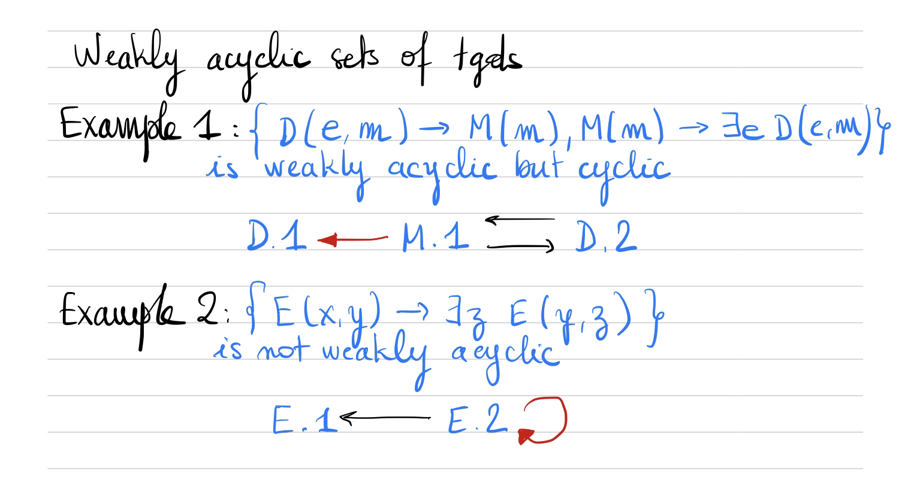

# Interopérabilité

## Notes

### Les flèches

**Flèche noire** : représente le chemin de la variable exportée de sa position de départ à sa position d'arrivée

- Dans `D(e,m) -> M(m)` le `m` est la variable exportée de `D.2` à `M.1`
- Dans `M(m) -> ∃e D(e,m)` le `m` est la variable exportée de `M.1` à `D.2`
- Dans `E(x,y) -> ∃z E(y,z)` le `y` est la variable exportée de `E.2` à `E.1`

**Flèche rouge** : représente le départ de la variable exportée et l'arrivée de la variable du *il existe*

- Dans `M(m) -> ∃e D(e,m)` le `m` est la variable exportée de `M.1` et `D.1` est l'arrivée de la variable `e` du *il existe*
- Dans `E(x,y) -> ∃z E(y,z)` le `y` est la variable exportée de `E.2` et `E.2` est l'arrivée de la variable `z` du *il existe*
