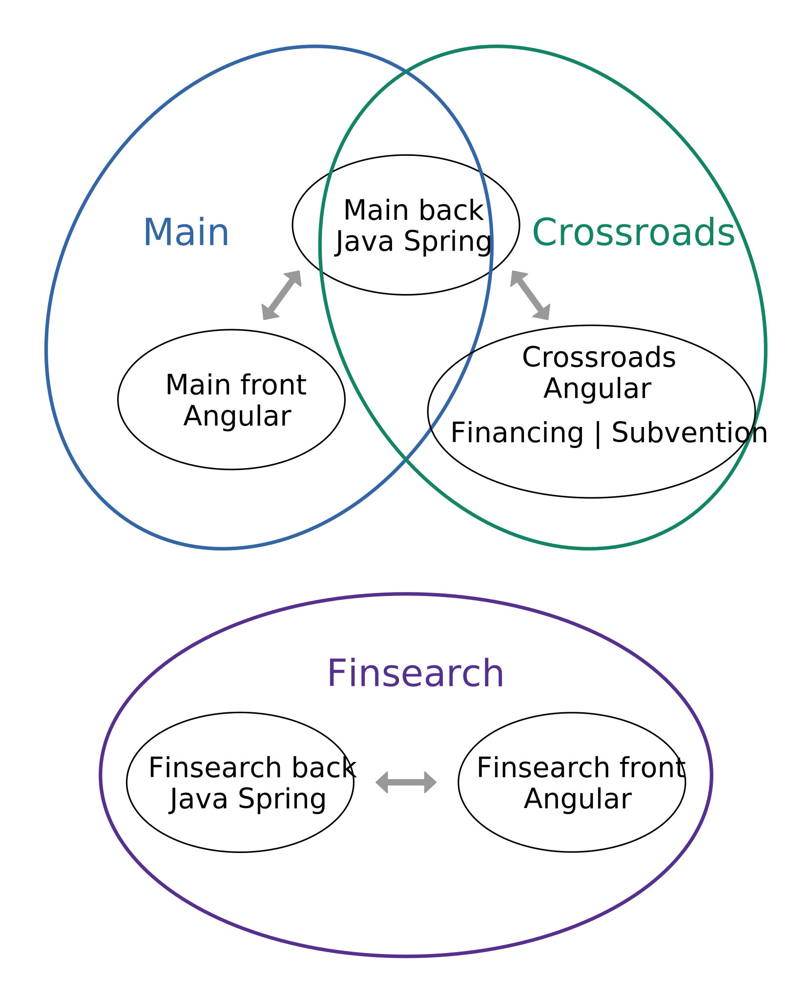

# Rapport

## Contexte des projets

Finalgo est une startup spécialisée dans

- la recherche de financements,
- la construction et la gestion de dossiers de financement,
- la recherche de subvention.

Nous développons des applications web pour répondre à ces besoins en SaaS<sup>1</sup>, nos clients ont donc un abonnement payant pour accéder à ces plateformes.

Cette année j'ai participé au développement des quatre projets principaux de Finalgo,

- **Main** notre application de construction et de gestion de dossiers de financement,
- **Crossroads Financing** notre application de recherche de financements,
- **Crossroads Subvention** notre application de recherche de subventions,
- **Finsearch** une sorte de Main simplifié dont nous gérons le développement et la maintenance pour l'un de nos clients.

En terme de code chaque application possède un front<sup>2</sup> Angular et un back<sup>3</sup> Java Spring Boot qui fonctionne sous forme d'une API REST. Le back est le même pour Main et pour Crossroads, puis Finsearch possède un front et un back ce qui nous fait 5 projets informatiques différents.

1 : *Software as a service*  
2 : *Client web accessible aux utilisateurs*  
3 : *Serveur appelé par le client web*



\* Les doubles flèches symbolisent les échanges de données entre front et back

---

## Tâches

### Écran d'administration de Finsearch

Sur le projet Finsearch j'ai réalisé l'écran de gestion des administrateurs. Cet écran n'est accessible pour les utilisateurs normaux. Il affiche un tableau dont chaque ligne récapitule l'avancement d'un utilisateur dans la gestion de son plan de financement. Il est possible de trier le tableau à partir de ses colones et l'administrateur peut se connecter sur le compte d'un utilisateur à partir de sa ligne dans le tableau.

### Ajout du SSO sur les projets

On m'a confié toutes les tâches relatives au SSO OAUTH2 (Single Sign-On), l'objectif de ces tâches est de permettre aux utilisateurs de se connecter sur nos plateformes à partir de leurs comptes déjà existants sur d'autres plateformes comme Google ou Microsoft.

Personne n'avait développé ce type de fonctionnalité dans les projets de Finalgo, j'ai donc écrit une page sur notre *wiki*<sup>4</sup> interne pour expliquer le fonctionnement du SSO et retrouver facilement les documentations.

Il faut savoir que pour être connecté, notre front doit avoir récupérer l'utilisateur ainsi qu'un JWT généré par notre back.

4 : *Projet Google Sites qui nous sert de documentation interne*

#### SSO Microsoft Azure sur Main

J'ai commencé par implémenter une connexion SSO spécifique à l'un des clients<sup>5</sup> de Main, leur entreprise utilise la suite Microsoft Azure qui permet la mise en place du SSO pour ses employés. Pour cette tâche tous les comptes existaient déjà sur Main. Dans un premier temps j'ai ajouté leur page de connexion qui se charge de récupérer un JWT (JSON Web Token), ensuite le front transmet ce token au back qui se charge de vérifier sa validité et de connecter l'utilisateur.

Pour le front Microsoft fournit une librairie qui permet de gérer la connexion SSO, il suffit de lui fournir divers identifiants. Ensuite la librairie nous retourne un token et on l'envoie au back pour se connecter.

En back il n'était pas possible d'utiliser les librairies de SSO pour des raisons de conflit avec le système de connexion normal. Le plus simple était de vérifier le token manuellement puis de renvoyer un nouveau JWT. Pour ce faire j'ai récupéré l'identifiant du token (`kid`) dans son entête, puis je m'en suis servi pour retrouver sa clé publique au format texte sur l'API de Microsoft. J'ai ensuite converti cette clé en un objet de type `PublicKey` ce qui m'a permi de vérifier la signature du token, puis sa date de validité avec la librairie `JWT`. Une fois que le token est validé, le back retourne un nouveau JWT au front qui l'utilise pour récupérer l'utilisateur courant et se connecter.

5 : *Un client est une entreprise, plusieurs utilisateurs y sont associés*

#### SSO Google et Quickbooks sur Crossroads

Sur le projet Crossroads j'ai implémenté la connexion SSO depuis les plateformes Google et Quickbooks. Pour cette tâche il fallait gérer la création de compte en plus de la connexion. J'ai fait en sorte d'utiliser un code très générique pour qu'il soit facile d'ajouter une nouvelle plateforme, cette tâche a nécessité la réécriture de mon code sur le SSO en back.

Avant d'implémenter le SSO j'ai effectué une manipulation sur les interfaces de Google et de Quickbooks. L'objectif était de configurer une application sur ces plateformes afin d'obtenir divers identifiants nécessaires. J'ai également modifié la page de connexion du front de façon à ce qu'on puisse lui transmettre un JWT en paramètre dans l'URL, et qu'elle s'en serve pour récupérer l'utilisateur courant afin de se connecter.

Pour Google j'ai utilisé une librairie en front afin de rediriger les utilisateurs sur leur page de connexion. Une fois connecté j'ai configuré Google pour les rediriger sur une API en back, le JWT est alors dans l'URL. J'ai utilisé un système similaire à Microsoft Azure pour vérifier la validité du token et récupérer les informations qu'il contient. Ensuite j'ai géré l'éventuelle création de compte, puis j'ai redirigé les utilisateurs sur la page de connexion avec un nouveau JWT dans l'URL pour que le front termine sa connexion.

Pour Quickbooks il y a une librairie Java qui permet de simplifier tout le développement. En front j'ai simplement redirigé l'utilisateur sur une API du back. Cette API se charge de rediriger les utilisateurs sur leur page de connexion, ensuite Quickbooks est configuré pour rediriger l'utilisateur sur une deuxième API du back. Cette API se charge de vérifier le token et de récupérer les informations pour la création de compte en utilisant la librairie fournie par Quickbooks. Une fois authentifié, chaque utilisateur est redirigé sur le front avec un nouveau JWT dans l'URL et termine sa connexion.

En terme de généricité du code en back j'ai factorisé le fonctionnement des trois types de SSO en déplaçant toute la partie spécifique dans une classe Enum. Pour chaque type de SSO il y a une URL vers l'API des clés publiques au format JSON, le chemin à utiliser pour trouver la bonne clé dans le JSON à partir du `kid`, les clés à utiliser pour récupérer l'email dans le token, et un booléen pour indiquer si le texte de la clé publique est encodé en Base64 ou non. J'ai crée la fonction qui prend en entrée un objet de type JSON, un chemin similaire à XPath pour le JSON, et qui retourne le sous-élément du JSON correspondant au chemin.  
Grâce à cet Enum Java j'ai pu réduire le code à seule fonction générique pour récupérer la clé publique d'un token, vérifier sa validité et récupérer les informations d'un utilisateur.

```Java
AZURE(
    "https://login.microsoftonline.com/{appId}/discovery/v2.0/keys",
    "keys/?kid=%s/x5c/0", // Le `%s` est remplacé par la valeur de `kid`
    true, // Il faut utiliser un décodeur de Base64
    Arrays.asList("unique_name", "upn", "preferred_username") // Le premier de ces champs à ne pas être vide est l'email
),
GOOGLE(
    "https://www.googleapis.com/oauth2/v1/certs",
    "%s",
    false,
    Arrays.asList("email")
),
QUICKBOOKS(); // Géré par la librairie Quickbooks
```

### Ajout d'un antivirus sur Main

J'ai mis en place l'antivirus ClamAV sur Main pour vérifier que les pièces administratives déposées par les utilisateurs ne contiennent pas de virus.

Avant de commencer le développement de cette tâche j'ai effectué des recherches pour trouver comment utiliser un antivirus avec Java sur une machine sous Linux, c'est comme ça que j'ai eu connaissance de ClamAV. Ensuite je l'ai installé sur ma machine et sur notre serveur. L'installation de cet antivirus nécessite une vingtaine de commandes qui ne sont pas bien documentés, j'ai donc rajouté une page sur notre *wiki* où j'ai décrit toute la procédure. J'ai également crée un service pour lancer automatiquement ClamAV au démarrage de Linux et pour le mettre à jour automatiquement.

Une fois l'antivirus démarré j'ai pu utiliser la librairie Java fournie par ClamAV pour coder une fonction de vérification des fichiers. J'ai ensuite branché cette fonction sur l'API d'upload des pièces administratives et j'ai crée un code d'erreur correspondant à une pièce refusée car infectée. J'ai également déclenché l'envoi d'un message sur le Slack de Finalgo en cas de problème inconnu avec l'antivirus. En front j'ai utilisé le code d'erreur pour afficher un message en cas de menace détectée.

### Personnalisation de la note de synthèse

Lorsqu'un dossier de financement est complet nous générons un PDF que les clients transmettent à leur banque, ce document s'appelle la *note de synthèse*. J'ai réalisé une fonctionnalité qui permet d'afficher n'importe quelle information du dossier d'un client à l'endroit souhaité sur sa page de couverture, avec diverses possibilités de formatage du texte.

Je me suis plongé dans la documentation de la librairie `IText` que nous utilisons pour générer les PDF et j'ai modifié le traitement de la première page de façon à réaliser cette tâche. J'ai crée un système avec des fichier de configuration JSON pour que chaque client puisse avoir le contenu qu'il souhaite sur sa première page. Dans ce fichier nous mettons la liste des éléments qui doivent apparaître, avec pour chaque élément le texte à affichier ou le nom de la variable correspondante, les coordonnées de l'élément, la police et l'alignement à utiliser (droite, gauche, centre).

### Réécriture du système de paiement

J'ai réécris tout le code concernant les paiements avec Stripe, le paiement fonctionnait déjà via Stripe mais le code était difficile à modifier et la version de l'API utilisée était dépréciée.

En front j'ai enlevé tous les traitements inutiles de façon à n'avoir qu'une liste de produits avec chacun un code "produit prix" unique associé. Stripe utilise ces code pour afficher les pages de paiement.

En back j'ai réécrit la fonction qui traite la confirmation de paiement envoyée par Stripe. J'ai modifié l'énumérateur des produits pour les associer à leur identifiant de produit Stripe, sans rapport avec le code "produit prix". Puis j'ai utilisé ces codes pour repérer quel produit a acheté l'utilisateur concerné et effectuer les traitements qui en découlent. J'ai également utilisé l'API de Stripe pour récupérer le nom associé au paiement et mettre à jour le nom de l'utilisateur s'il ne l'a pas renseigné dans son profil, l'inscription ne nécessite que l'email.

### Création du produit Subvention

On m'a chargé de créer un MVP (Produit Viable au Minimum) d'outil de recherche de subventions pour les entreprises, basé sur l'API `aides-entreprises.fr`. J'ai mis environ deux semaines à réaliser ce MVP et par la suite, toute l'équipe s'est mise à travailler sur le produit Subvention. L'objectif était d'améliorer suffisament le produit dans tous ces aspects pour mettre en place des abonnements. J'ai commencé ce projet fin janvier, les abonnements sont en place depuis plusieurs mois et toute l'équite travail encore sur l'amélioration de ce produit.

#### Mise en place du MVP en back

J'ai commencé par regarder la page swagger de l'API `aides-entreprises.fr`, j'ai testé massivement les différentes ressources (URL) que l'API offre ainsi que quelques paramètres pour certaines d'entre elles. Une fois l'API en main j'ai crée un service qui permet d'appeler chacune des ressources de l'API, avec tous les éventuels paramètres.

Certaines des API permettaient de récupérer les différents critères de recherche comme les départements, les secteurs d'activité ou la taille de l'enterprise. J'ai donc ajouté des API sur notre back pour que le front puisse récupérer ces différents critères. Il était alors possible pour le front de récupérer les *valeurs* possible pour un critère, et de connaître la *clé* `aides-entreprises.fr` associée à chacune de ces valeurs.  
L'exemple suivant illustre le principe de *valeur* et de *clé* pour le critère *taille de l'entreprise*.

```json
[
    { "key": "1", "value": "Moins de 10 salariés" },
    { "key": "2", "value": "Entre 10 et 50 salariés" },
    { "key": "3", "value": "Plus de 50 salariés" }
]
```

Une fois le service et les API opérationnelles j'ai crée une API qui se charge de récupérer les *clés* des réponses d'un utilisateur, d'effectuer une recherche de subvention via le service et de transmettre les résultats au front.

#### Mise en place du MVP en front

Pour le front il nous fallait un système de formulaire avec la possibilité d'avoir plusieurs chemins de questions, une gestion de compte et un moyen d'afficher des résultats. Il s'agissait exactement de ce que faisait Crossroads, qui à ce moment là ne servait qu'à la recherche de financement. Il a donc fallu séparer Crossroads en deux, et surtout réécrire le code du formulaire qui mélangeait des traitements métier avec des traitements de formulaire générique.

##### Séparation des composants

Sur Crossroads tout ce qui est spécifique à un formulaire se trouve dans un fichier JSON. On y trouve l'intitulé de chaque question, les réponses possibles, le type de la question et la condition pour qu'elle apparaîsse.

J'ai séparé en deux le composant qui se chargeait d'afficher dynamiquement chaque question du formulaire et de gérer la partie spécifique aux plans de financement. J'ai utilisé l'héritage entre les classes TypeScript de façon à ce que le composant du formulaire *Financing* hérite du composant de formulaire générique. J'ai donc déplacé chaque fonction dans le bon composant et j'ai réglé toutes les erreurs dues à des fonctionnements asynchrones et à des variables utilisées par les deux composants.

J'ai également réécris le composant de la page des résultats de façon à ce qu'elle encapsule un autre composant qui lui est spécifique à l'affichage du résultat.

##### Formulaire spécifique aux subventions

J'ai crée un composant qui hérite du formulaire générique pour y ajouter le code spécifique aux subventions. J'ai établi la première version du formulaire au format JSON, j'ai fait en sorte que les réponses possibles de certaines questions soit requêtées sur le back et j'ai ajouté des questions dont le contenu provient directement des subventions que nous retourne l'API `aides-entreprise.fr`.

#### Analyse du comportement de l'API `aides-entreprises.fr`

Dans le cadre de l'amélioration du formulaire après la création du MVP j'ai étudié chacun des critère de recherche que l'API `aides-entreprise.fr` nous permet d'utiliser. J'ai simulé le comportement de notre application avec PostMan pour expliquer des résultats incohérents, j'ai écrit un script pour générer des statistiques sur la couverture en subvention des différents critères et j'ai réunis toutes ces données sur une page de notre *wiki*. J'ai également utilisé les informations réunies pour améliorer le formulaire et augmenter le nombre de subventions pertinantes.

### Améliorations du produit Subvention

Pour la suite des tâches sur les subventions il faut savoir que nous avons utilisé un algorithme qui relachait certains critères de recherches, dans un ordre déterminé, de façon à trouver des subventions lorsque les critères de recherche étaient trop contraignants.

#### Recherche par mots clés

J'ai ajouté une question dans le formulaire qui demande aux utilisateurs d'entrer des mots clés en rapport avec leur projet ou leur entreprise. J'ai crée un algorithme pour enlever l'essentiel des mots de liaison inutiles. J'ai utilisé l'algorithme de relachement des contraintes de façon à n'envoyer que les subventions qui contiennent l'un des mots clés de l'utilisateurs dans un premier temps, puis si elles sont toutes refusées nous envoyons les autres subventions car les mots clés des utilisateurs ne sont pas fiables.

#### Pré-remplissage du formulaire grâce au siret

Dans le but de pré-remplir les réponses du formulaire j'ai utilisé le numéro de siret des utilisateurs afin de récupérer le nom de leur entreprise, son effectif, son secteur d'activité et le département de son siège social. J'ai utilisé l'API `Sirene` de l'INSEE afin de récupérer les informations sur le code siret, notament le nom, l'effectif, l'adresse et le code NAF. J'ai ensuite utilisé une table de conversion réalisée par un membre de l'équipe afin de récupérer la liste des secteurs d'activité potentiels associés à chaque code NAF.

### Récupération des mots clés pour l'algorithme d'IA

Dans l'optique de générer des mots clés pertinents avec des outils de d'IA<sup>6</sup> (NLP<sup>7</sup>), on m'a chargé de générer la liste de tous les mots utilisés dans les subventions, avec pour chaque mot la liste des subventions dans lesquelles il est présent.

J'ai requêté l'intégralité des subventions de l'API, j'ai élaboré un algorithme de nettoyage des caractères spéciaux pour uniformiser les différents encodages utilisés et enlever ce qui ne compose pas les mots, puis j'ai parcouru les subventions et j'ai construit une Map qui associe à chaque mot la liste des identifiants de subventions où il est présent. Le plus difficile a été l'uniformisation de l'unicode échapé, de l'HTML échapé, des caractères non échapés et le nettoyage des balises HTML, des classes CSS et autres formes de texte parasite.

Cet algorithme de nettoyage a permis de passer d'environ 40 000 à 12 000 mots différents, soit 4 fois moins.

6 : *Artificial Intelligence*  
7 : *Natural Language Processing, branche de l'IA qui traite le texte*

#### Indépendance de l'API `aides-entreprises.fr`

Nous étions trop dépendants de l'API des aides ce qui était problématique en terme de performances et en terme de résistance aux pannes. Nous effectuions énormément de requêtes à cette API, à la fois pour des recherches mais aussi pour charger des subventions dont nous connaissions déjà les identifiants. Le but de ma tâche était de ne plus avoir besoin de l'API pour charger des subventions, et d'avoir une solution de secours en cas de panne de l'API.

J'ai mis en place une API appelée tous les jours par un cron<sup>8</sup> afin de copier la base de données des subventions sur notre serveur. Cette API se charge de télécharger les fichiers JSON accessibles depuis le site `aides-entreprises.fr` mais aussi de requêter l'intégralité des subventions depuis l'API. Il faut savoir qu'en utilisant l'API il y a du code HTML dans les subventions afin de mettre en forme leur contenu, ce n'est pas le cas avec les fichiers ; les deux sont donc nécessaires pour une copie complète de leur base de données.  
J'ai également mis en place un traitement pour nettoyer les caractères échapés en unicode ou en HTML sur toutes les données récupérées. Ce traitement résulte de l'amélioration de mon algorithme de nettoyage, utilisé pour récupérer les mots clés.

```json
// Avant traitement
{
    "aid_nom": "\"Zone … \" - Exon\u00e9ration d'imp\u00f4t …",
    "aid_objet": "<div align=\"justify\"> … d&eacute;veloppement … </div>"
}

// Après traitement
{
    "aid_nom": "\"Zone … \" - Exonération d'impôt …",
    "aid_objet": "<div align=\"justify\"> … développement … </div>"
}
```

Enfin, j'ai fait en sorte que Java charge la copie des subventions avec HTML au démarrage du serveur dans une Map indexé sur les identifiants des subventions. De cette façon j'ai pu remplacer tous les chargements de subventions via l'API par des appels à cette Map. Le temps de chargement des subventions sur la page d'accueil de notre produit était de 50 à 100 ms par subvention à charger, soit souvent plusieurs secondes. Cette fonctionnalité a divisé ce temps de chargement par environ 30, soit sistématiquement moins d'une seconde.

8 : *Programme qui se déclenche automatiquement de façon prédéfini*

### Tâches notables diverses

#### Ajout d'un système d'unité sur les Oca

Les `Oca` sont des informations sur le type du contenu des OcaVariables, des objets très génériques qui stockent une donnée queconque associé à un objet en base de données. Par exemple "nombre d'employés" et "email du signataire" pouraient être des Oca, respectivement associés à une entreprise et à un projet.

En back j'ai ajouté à certains Oca un champ *unité* qui permet d'indiquer quelle unité est associée à cet Oca. Dans ce champ j'ai renseigné un nouvel énumérateur qui associe pour chaque type d'unité le symbole ou la valeur associée (mois, %, €, année(s)). J'ai ensuite propagé cette unité dans le front où j'ai pu enlever le rajout manuel et souvent ambigue de ces "symboles". Maintenant l'unité est reliée à la donnée et non au code HTML d'un composant.

#### Conservation des paramètres GET sur Crossroads

J'ai modifié tous les liens du projet Crossroads de façon à conserver les paramètres présents dans l'URL, sauf exception. Cette modification a permi de régler divers bugs en rapport avec des traitements asynchrones sur les valeurs de ces paramètres.

#### Génération d'un énumérateur Java à partir d'un CSV

En back j'ai eu besoin d'utiliser des données statiques sur les codes NAF dont la source était un fichier CSV. À Finalgo dans ce type de situation nous préférons utiliser un énumérateur Java plutôt que de charger des fichiers. Le fichier faisait plusieurs centaines de lignes, j'ai écris un script en *nodejs* pour générer le code Java depuis le CSV.

#### Résolution d'un bug d'accès simultané au back

Après le lancement du produit subvention, nous avons commencé à observer des bugs très étranges d'utilisateurs associés au mauvais projet ou à la mauvaise entreprise sur Main. Le problème s'est agravé jusqu'à se produire plusieurs fois par jour, ce qui est devenu grave. Nous avons supposé que lors de requêtes simultanées, la récupération de l'utilisateur courant (`getCurrentUser`) ne renvoyait pas forcément le bon utilisateur.

J'ai mis en place un scénario de test qui m'a permi de confirmer le non fonctionnement du `getCurrentUser`. J'ai trouvé la source du problème, une variable de session utilisée pour stocker l'utilisateur courant (récupéré avec son JWT), cachée derrière une couches d'abstraction inutiles nommée `RequestUserContext`. La session étant partagée avec les différentes requêtes en cours, le problème venait de là.

J'ai supprimé tout le code relatif à cette abstraction et à cette variable de session pour tout remplacer par des appels directes à la classe `RequestContextHolder` de Spring, qui permet de manipuler des variables de requête. L'utilisation de cette classe a réparé le `getCurrentUser`, a réduit le temps d'exécution de certaines API de notre back et a réglé un problème de dépendance cyclique qui nous poussait à dupliquer certaines fonctions.

## Retour d'expérience

Ça m'a appri

- à coder en PL-SQL sur un serveur MySQL 8
- à coder au debugger
- à coder du code qui résiste au segfault
- à coder plus simple et plus générique et à compiler le spécifique dans un coin genre un enum
- la création, la mise en place, la vente et l'évolution d'un produit de A à Z en mode MVP
- à lire une doc, genre beaucoup trop de docs, mais aussi à pas trop les lire et surtout à regarder stack overflow
- à sérieusement mieux utiliser git, au sens commiter les bonnes lignes uniquement, abuser du stash et des branches, abuser du merge --no-commit, globalement abuser de l'interface graphique
- à never trust the user même si le user c'est moi
- à documenter mon travail (commentaires mais surtout *wiki*)
- à définir un lexique et essayer de le respecter histoire que toute l'équipe comprenne de quoi on parle
