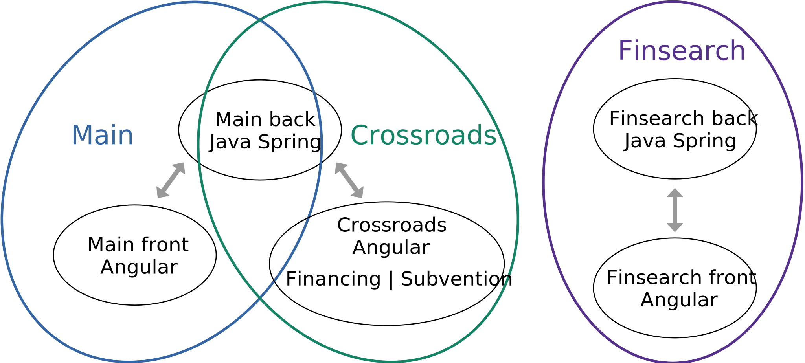

# Rapport

## Contexte des projets

Finalgo est une startup spécialisée dans

- la recherche de financements,
- la construction et la gestion de dossiers de financement,
- la recherche de subvention.

Nous développons des applications web pour répondre à ces besoins en SaaS<sup>1</sup>, nos clients ont donc un abonnement payant pour accéder à ces plateformes.

Cette année j'ai participé au développement des quatre projets principaux de Finalgo,

- **Main** notre application de construction et de gestion de dossiers de financement,
- **Crossroads Financing** notre application de recherche de financements,
- **Crossroads Subvention** notre application de recherche de subventions,
- **Finsearch** une sorte de Main simplifié dont nous gérons le développement et la maintenance pour l'un de nos clients.

1 : *Software as a service*

En terme de code chaque application possède un front Angular et un back Java Spring qui fonctionne sous forme d'une API REST. Le back est le même pour Main et pour Crossroads, puis Finsearch possède un front et un back ce qui nous fait 5 projets.



\* Les doubles flèches symbolisent les échanges de données entre front et back

---

## Tâches

### Tâche Finsearch

Sur le projet Finsearch j'ai réalisé l'écran de gestion des administrateurs. Cet écran n'est accessible pour les utilisateurs normaux. Il affiche un tableau dont chaque ligne récapitule l'avancement d'un utilisateur dans la gestion de son plan de financement. Il est possible de trier le tableau à partir de ses colones et l'administrateur peut se connecter sur le compte d'un utilisateur à partir de sa ligne dans le tableau.

### Tâche SSO

On m'a confié toutes les tâches relatives au SSO OAUTH2 (Single Sign-On), l'objectif de ces tâches est de permettre aux utilisateurs de se connecter sur nos plateformes à partir de leurs comptes déjà existants sur d'autres plateformes comme Google ou Microsoft.

Personne n'avait développé ce type de fonctionnalité dans les projets de Finalgo, j'ai donc écrit une page sur notre "wiki" interne pour expliquer le fonctionnement du SSO et retrouver facilement les documentations.

Il faut savoir que pour être connecté, notre front doit avoir récupérer l'utilisateur ainsi qu'un JWT généré par notre back.

#### Microsoft Azure sur Main

J'ai commencé par implémenter la connexion SSO pour l'un des clients de Main, leur entreprise utilise la suite Microsoft Azure qui permet la mise en place du SSO pour ses employés. Pour cette tâche tous les comptes existaient déjà sur Main. Dans un premier temps j'ai ajouté leur page de connexion qui se charge de récupérer un JWT (JSON Web Token), ensuite le front transmet ce token au back qui se charge de vérifier sa validité et de connecter l'utilisateur.

Pour le front Microsoft fournit une librairie qui permet de gérer la connexion SSO, il suffit de lui fournir divers identifiants. Ensuite la librairie nous retourne un token et on l'envoie au back pour se connecter.

En back il n'était pas possible d'utiliser les librairies de SSO pour des raisons de conflit avec le système de connexion normal. Le plus simple était de vérifier le token manuellement puis de renvoyer un nouveau JWT. Pour ce faire j'ai récupéré l'identifiant du token (`kid`) dans son entête, puis je m'en suis servi pour retrouver sa clé publique au format texte sur l'API de Microsoft. J'ai ensuite converti cette clé en un objet de type `PublicKey` ce qui m'a permi de vérifier la signature du token, puis sa date de validité avec la librairie `JWT`. Une fois que le token est validé, le back retourne un nouveau JWT au front qui l'utilise pour récupérer l'utilisateur courant et se connecter.

#### Google et Quickbooks sur Crossroads

Sur le projet Crossroads j'ai implémenté la connexion SSO depuis les plateformes Google et Quickbooks. Pour cette tâche il fallait gérer la création de compte en plus de la connexion. J'ai fait en sorte d'utiliser un code très générique pour qu'il soit facile d'ajouter une nouvelle plateforme, cette tâche a nécessité la réécriture de mon code sur le SSO en back.

Avant d'implémenter le SSO j'ai effectué une manipulation sur les interfaces de Google et de Quickbooks. L'objectif était de configurer une application sur ces plateformes afin d'obtenir divers identifiants nécessaires. J'ai également modifié la page de connexion du front de façon à ce qu'on puisse lui transmettre un JWT en paramètre dans l'URL, et qu'elle s'en serve pour récupérer l'utilisateur courant afin de se connecter.

Pour Google j'ai utilisé une librairie en front afin de rediriger les utilisateurs sur leur page de connexion. Une fois connecté j'ai configuré Google pour les rediriger sur une API en back, le JWT est alors dans l'URL. J'ai utilisé un système similaire à Microsoft Azure pour vérifier la validité du token et récupérer les informations qu'il contient. Ensuite j'ai géré l'éventuelle création de compte, puis j'ai redirigé les utilisateurs sur la page de connexion avec un nouveau JWT dans l'URL pour que le front termine sa connexion.

Pour Quickbooks il y a une librairie Java qui permet de simplifier tout le développement. En front j'ai simplement redirigé l'utilisateur sur une API du back. Cette API se charge de rediriger les utilisateurs sur leur page de connexion, ensuite Quickbooks est configuré pour rediriger l'utilisateur sur une deuxième API du back. Cette API se charge de vérifier le token et de récupérer les informations pour la création de compte en utilisant la librairie fournie par Quickbooks. Une fois authentifié, chaque utilisateur est redirigé sur le front avec un nouveau JWT dans l'URL et termine sa connexion.

En terme de généricité du code en back j'ai factorisé le fonctionnement des trois types de SSO en déplaçant toute la partie spécifique dans une classe Enum. Pour chaque type de SSO il y a une URL vers l'API des clés publiques au format JSON, le chemin à utiliser pour trouver la bonne clé dans le JSON à partir du `kid`, les clés à utiliser pour récupérer l'email dans le token, et un booléen pour indiquer si le texte de la clé publique est encodé en Base64 ou non. J'ai crée la fonction qui prend en entrée un objet de type JSON, un chemin similaire à XPath pour le JSON, et qui retourne le sous-élément du JSON correspondant au chemin.  
Grâce à cet Enum Java j'ai pu réduire le code à seule fonction générique pour récupérer la clé publique d'un token, vérifier sa validité et récupérer les informations d'un utilisateur.

```Java
AZURE(
    "https://login.microsoftonline.com/{appId}/discovery/v2.0/keys",
    "keys/?kid=%s/x5c/0", // Le `%s` est remplacé par la valeur de `kid`
    true, // Il faut utiliser un décodeur de Base64
    Arrays.asList("unique_name", "upn", "preferred_username") // Le premier de ces champs à ne pas être vide est l'email
),
GOOGLE(
    "https://www.googleapis.com/oauth2/v1/certs",
    "%s",
    false,
    Arrays.asList("email")
),
QUICKBOOKS(); // Géré par la librairie Quickbooks
```

### Ajout d'un antivirus sur Main

J'ai mis en place l'antivirus ClamAV sur Main pour vérifier que les pièces administratives déposées par les utilisateurs ne contiennent pas de virus.

Avant de commencer le développement de cette tâche j'ai effectué des recherches pour trouver comment utiliser un antivirus avec Java sur une machine sous Linux, c'est comme ça que j'ai eu connaissance de ClamAV. Ensuite je l'ai installé sur ma machine et sur notre serveur. L'installation de cet antivirus nécessite une vingtaine de commandes qui ne sont pas bien documentés, j'ai donc rajouté une page sur notre "wiki" où j'ai décrit toute la procédure. J'ai également crée un service pour lancer automatiquement ClamAV au démarrage de Linux et pour le mettre à jour automatiquement.

Une fois l'antivirus démarré j'ai pu utiliser la librairie Java fournie par ClamAV pour coder une fonction de vérification des fichiers. J'ai ensuite branché cette fonction sur l'API d'upload des pièces administratives et j'ai crée un code d'erreur correspondant à une pièce refusée car infectée. J'ai également déclanché l'envoi d'un message sur le Slack de Finalgo en cas de problème inconnu avec l'antivirus. En front j'ai utilisé le code d'erreur pour afficher un message en cas de menace détectée.

### Personnalisation de la note de synthèse

Lorsqu'un dossier de financement est complet nous générons un PDF que les clients transmettent à leur banque, ce document s'appelle la *note de synthèse*. J'ai réalisé une fonctionnalité qui permet d'afficher n'importe quelle information du dossier d'un client à l'endroit souhaité sur sa page de couverture, avec diverses possibilités de formatage du texte.

Je me suis plongé dans la documentation de la librairie `IText` que nous utilisons pour générer les PDF et j'ai modifié le traitement de la première page de façon à réaliser cette tâche. J'ai crée un système avec des fichier de configuration JSON pour que chaque client puisse avoir le contenu qu'il souhaite sur sa première page. Dans ce fichier nous mettons la liste des éléments qui doivent apparaître, avec pour chaque élément le texte à affichier ou le nom de la variable correspondante, les coordonnées de l'élément, la police et l'alignement à utiliser (droite, gauche, centre).

### Produit subvention

On m'a chargé de créer un MVP (Produit Viable au Minimum) d'outil de recherche de subventions pour les entreprises, basé sur l'API `aides-entreprises.fr`. J'ai mis environ deux semaines à réaliser ce MVP et par la suite, toute l'équipe s'est mise à travailler sur le produit Subvention. L'objectif était d'améliorer suffisament le produit dans tous ces aspects pour mettre en place des abonnements. J'ai commencé ce projet fin janvier, les abonnements sont en place depuis plusieurs mois et toute l'équite travail encore sur l'amélioration de ce produit.

#### Mise en place du MVP en back

J'ai commencé par regarder la page swagger de l'API `aides-entreprises.fr`, j'ai testé massivement les différentes ressources (URL) que l'API offre ainsi que quelques paramètres pour certaines d'entre elles. Une fois l'API en main j'ai crée un service qui permet d'appeler chacune des ressources de l'API, avec tous les éventuels paramètres.

Certaines des API permettaient de récupérer les différents critères de recherche comme les départements, les secteurs d'activité ou la taille de l'entrprise. J'ai donc ajouté des API sur notre back pour que le front puisse récupérer ces différents critères. Il était alors possible pour le front d'afficher les *valeurs* possible pour un critère, et de connaître la *clé* `aides-entreprises.fr` associée à chacune de ces valeurs.  
L'exemple suivant illustre le principe de *valeur* et de *clé* pour le critère *taille de l'entreprise*.

```json
[
    { "key": "1", "caption": "Moins de 10 salariés" },
    { "key": "2", "caption": "Entre 10 et 50 salariés" },
    { "key": "3", "caption": "Plus de 50 salariés" }
]
```

Une fois le service et les API opérationnelles j'ai crée une API qui se charge de récupérer les *clés* des réponses d'un utilisateur, d'effectuer une recherche de subvention via le service et de transmettre les résultats au front.

#### Mise en place du MVP en front

Pour le front il nous fallait un système de formulaire avec la possibilité d'avoir plusieurs chemins de questions, une gestion de compte et un moyen d'afficher des résultats. Il s'agissait exactement de ce que faisait Crossroads, qui à ce moment là ne servait qu'à la recherche de financement. Il a donc fallu séparer Crossroads en deux, et surtout réécrire le code du formulaire qui mélangeait des traitements métier avec des traitements de formulaire générique.

##### Séparation des composants

Sur Crossroads tout ce qui est spécifique à un formulaire se trouve dans un fichier JSON. On y trouve l'intitulé de chaque question, les réponses possibles, le type de la question et la condition pour qu'elle apparaîsse.

J'ai séparé en deux le composant qui se chargeait d'afficher dynamiquement chaque question du formulaire et de gérer la partie spécifique aux plans de financement. J'ai utilisé l'héritage entre les classes TypeScript de façon à ce que le composant du formulaire *Financing* hérite du composant de formulaire générique. J'ai donc déplacé chaque fonction dans le bon composant et j'ai réglé toutes les erreurs dues à des fonctionnements asynchrones et à des variables utilisées par les deux composants.

J'ai également réécris le composant de la page des résultats de façon à ce qu'elle encapsule un autre composant qui lui est spécifique à l'affichage du résultat.

##### Formulaire spécifique aux subventions

J'ai crée un composant qui hérite du formulaire générique pour y ajouter le code spécifique aux subventions. J'ai établi la première version du formulaire au format JSON, j'ai fait en sorte que les réponses possibles de certaines questions soit requêtées sur le back et j'ai ajouté des questions dont le contenu provient directement des subventions que nous retourne l'API `aides-entreprise.fr`.

#### Génération des statistiques

Génération de statistiques de pertinence des critères de filtre des subvention
Révision de la priorité de chaque critère de filtre des subvention en fonction de ces résultats
Page wiki
J'ai mangé leur BD avec Postman
Traitement / analyse des données de l'API subvention, notamment des territoires avec PostMan
Mettre ma requête trop cool de BD

#### Améliorations

##### Moins de travail pour l'utilisateur mais autant de données

Préciser quand même que c'est en pause et planté depuis un moment

Dans le formulaire des subvention, remplissage automatique de certaines questions à partir des informations du code siret qu'on récupère depuis l'API de l'INSEE
Création de table de convertion code effectif siret -> code effectif aides-entreprises et code postal -> code territoire aides-entreprises
ajout des informations récupérées par le code siret dans le mode debug du front (front et back)
récupération automatique du profil aides-entreprises à partir du numéro de siret (back)

##### Recherche naïve par mots clés

ajout d'un système de recherche de subvention par mots clés (back)
ajout de la question pour récupérer les mots clés (front)
ajout d'un système de niveau de priorité des paramètres aides-entreprises pour améliorer l'algorithme de relachement des contraintes

##### Indépendance de l'API

Ajout système de copie quotidien de la base de données des subventions avec un cron
Enregistrement de certaines informations des subventions dans notre base de données
Envoi de ces informations à notre front
Ajout d'un système de traitement spécifique des subventions pour ajouter de nouveaux critères que l'API aides-entreprises.fr ne prend pas en charge

###### Pour aller encore plus loin

Création d'un algorithme de nettoyage des caractères spéciaux dans le texte : balises html, escape html, escape unicode
Récupération de tous les mots distincts utilisés dans la base de données subvention, avec un objectif d'IA sur les mots

### Stripe

Refactoring du système de gestion des acticles Stripe pour quelque chose de plus généique et typé (permettant de détecter plus d'erreurs qu'avant) (crossroads)
Réimplémentation de toute l'API Stripe avec la dernière version, l'ancienne version était complètement dépréciée (crossroads)

Récupération automatique des captions des utilisateurs depuis leur facture Stripe
Debug de Stripe dont le callback était bloqué par notre JwtFilter

### Fonctionnalités spécifiques diverses

#### Système d'unité des OCA

Ajout d'un système d'unité (mois, %, €, année(s)) dans les OCA (système de stockage ressemblant à du NoSQL) (main back)

Ajout du système d'unité des OCA sur les ITE (propagation du système d'unité dans le front) (main front)

#### Conservation du GET sur Crossroads

Ajout d'un système de conservation des paramètres GET de l'URL

#### Génération enum depuis csv d'Araud

génération d'une class enum java à partir d'un fichier csv et de nodejs

#### Fix session context -> request context

Fix du problème de récupération de l'utilisateur connecté en back (bug avec les variables de session partagées)

---

## Retour d'expérience

Ça m'a appri

- à coder en PL-SQL sur un serveur MySQL 8
- à coder au debugger
- à coder du code qui résiste au segfault
- à coder plus simple et plus générique et à compiler le spécifique dans un coin genre un enum
- la création, la mise en place, la vente et l'évolution d'un produit de A à Z en mode MVP
- à lire une doc, genre beaucoup trop de docs, mais aussi à pas trop les lire et surtout à regarder stack overflow
- à sérieusement mieux utiliser git, au sens commiter les bonnes lignes uniquement, abuser du stash et des branches, abuser du merge --no-commit, globalement abuser de l'interface graphique
- à never trust the user même si le user c'est moi
- à documenter mon travail (commentaires mais surtout wiki)
- à définir un lexique et essayer de le respecter histoire que toute l'équipe comprenne de quoi on parle
