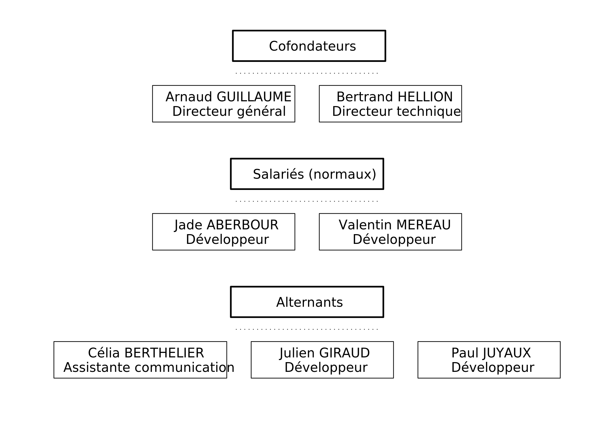
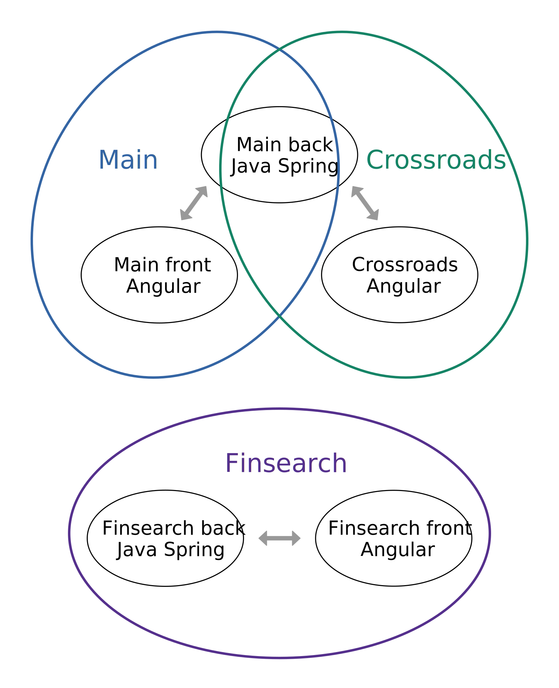
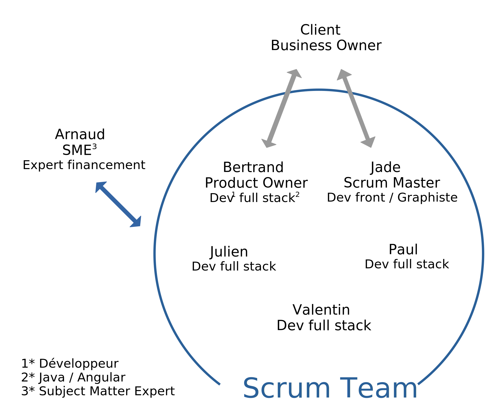

# Rapport alternant

## Page de garde

## Table des matières

- [Présentation de Finalgo](#Présentation\ de\ Finalgo)
  - [L'équipe](#L'équipe)
  - [Les projets](#Les\ projets)
- [Gestion des projets](#Gestion\ des\ projets)
  - [Organigramme Scrum](#Organigramme\ Scrum)
  - [Notre échelle de difficulté des tâches](#Notre\ échelle\ de\ difficulté\ des\ tâches)
  - [Rôles](#Rôles)
  - [Outils](#Outils)
    - [Slack](#Slack)
  - Café
  - Goûter
  - Asana
  - Meet
  - Slack

## Présentation de Finalgo

Finalgo est une startup spécialisée dans la recherche de financements, la construction et la gestion de dossiers de financement.

Finalgo est la première solution 100% digitale de recherche de financement. Elle permet à tous les dirigeants d’entreprise de construire et d’envoyer eux-même leurs dossiers de financements à tous types de partenaires financiers. www.finalgo.fr

Notre vocation :
Faciliter l'accès au financement pour les entrepreneurs, artisans, commerçants, dirigeants de TPE / PME
Mettre le numérique au service de l'humain.
Le financement est le carburant de l'entreprise, libérons le !

### L'équipe

À Finalgo la hiérarchie est complètement horizontale, l'organigramme est donc organisé suivant le type du poste.

### Les projets

Je participe au développement de trois projets, **Main** notre application principale, **crossroads** notre produit dirrigeant (idéalement l'avenir de Finalgo) et **finsearch** une sorte de Main simplifié dont nous gérons le développement et la maintenance pour l'un de nos clients.

En terme de code chaque application possède un front Angular et un back Java Spring qui fonctionne sous forme d'une API REST. Le back est le même pour Main et pour Crossroads, puis Finsearch possède un front et un back ce qui nous fait 5 projets.

## Gestion des projets

À Finalgo nous fonctionnons au maximum suivant la méthode Scrum. Étant donné que l'équipe est petite, certains jouent plusieurs rôles.

Étant donné que chacun a plus ou moins sa spécialité nous essayons de nous former mutuellement, au moins lorsque nous ne sommes pas pressés par le temps. Nous mettons aussi régulièrement à jour un wiki interne (Google Site) sur lequel nous répertorions toutes nos procédures (mises en production) et nous expliquons comment utiliser chaque technologie non standard (librairies, API externes).

### Organigramme Scrum

### Notre échelle de difficulté des tâches

| Nombre de points | Difficulté | Lignes de code | Temps de travail |
| ---------------- | ---------- | -------------- | ---------------- |
| 1 | Vraiment très facile | 1 à 10 | Une dizaine de minutes |
| 2 | Nous utilisons la suite de Fibonacci donc en théorie le `2` est possible mais nous ne l'utilisons jamais car il est trop proche du `1` |
| 3 | Facile | 5 à 30 | Une heure ou deux |
| 5 | Moyenne | 20 à 100 | Une demie journée |
| 8 | Difficile | 30 à 500 | Un jour ou deux |
| 13 | Très difficile | 50 à 2000 | Environ une semaine |
| 21 | Impossible, on estime que c'est la difficulté d'un projet entier. `21` signifie qu'il faut découper la tâche en une liste de sous-tâches | ∞ | Entre 6 mois et un millénaire |

\* Pour un même niveau de difficulté il y a en général beaucoup de lignes sur les tâches purement front et peu sur les tâches d'algorithmie ou de code métier.

### Rôles Scrum

**Bertrand** joue à la fois le rôle de **Product Owner** et de **développeur**.  
En tant que Product Owner il s'occupe de comprendre et lister les besoins de nos clients (Business Owner) afin de créer une liste tâches. Il essaie également de les rendre indépendantes dans la façon de les écrire pour permettre une bonne répartition au sein de l'équipe.  
En tant que développeur (et Docteur en recherche opérationnelle) il s'occupe d'assigner les points de difficulté aux tâches en rapport avec le back ou le code métier du front, et il nous aide à réaliser ces tâches.

*Jade : elle anime le goûter, quand j'ai de l'affichage à faire je vois ça avec elle, quand elle craque parce que Bertrand fait des bêtises parfois je l'aide

**Jade** occupe le double rôle de **Scum Master** et de **développeur front**.  
En tant que Scrum Master elle paticipe aux réunions clients avec Bertrand où elle s'occupe des démonstrations et elle gère les parties UX/UI en tant que graphiste de formation. Elle s'occupe aussi d'animer les réunions quotidiennes et d'organiser des sorties Team Building.  
En tant que développeur front et graphiste elle s'occupe de donner les points d'effort aux tâches purement front, elle participe avec nous à leur développement et elle design des maquêtes d'interfaces qui nous permettent de visualiser les User Stories.

**Valentin** est un développeur polyvalent qui a une très bonne connaissance du fonctionnement d'Angular et des approches DevOps. Il s'occupe de la gestion des serveurs, nous travaillons souvent ensemble sur les tâches complexes et il participe activement aux code review / Pull Request (PR).

**Paul** travaille tout comme moi sur le back et le front mais la plupart du temps nous ne travaillons pas ensemble. Il participe également à mes PR.

**Arnaud** est notre **SME** du point de vue Scrum, de formation expert comptable il est le seul membre de Finalgo à comprendre toutes les fonctionnalités métier de nos applications. Il nous remonte régulièrement des petits bugs métier ou d'interface et il a nombreuses idées d'amélioration de la plateforme.

### Outils

À Finalgo toute l'organisation est basée sur du travail en distanciel. Nous sommes donc équipés en outils de communication, visioconférence, gestion des tâches et suite de bureautique.

#### Slack

 Slack est notre outil de communication n°1 interne comme externe.

En interne nous avons un espace de travail avec des canaux de discussion pour absolument tout, ce qui permet de parfaitement gérer le type d'information dont on souhaite être notifié. Il y en a un par projet, un par **domaine**, un pour chaque **type de logs** et un pour les blagues (très important en terme de moral).

En externe nous avons un espace de travail pour chaque client, au sens entreprise qui utilise l'application Main et qui a demandé un développement spécifique.

*Domaines : informatique, marketing, communication, design, recrutement, teambuilding...

*Types de logs : une douzaine, il y en a un pour chaque serveur tomcat de production comme de développement (Ti), pour la totalité des logs (Ti,1), pour toutes les **actions utilisateur** (Ti,2) et pour tout ce qui nécessite notre intervention (Ti,3).

*Actions utilisateur : connexion, création d'un projet, upload d'un document...

Paul : il fait à peu près pareil que moi mais sur d'autres projets, on a jamais trop travaillé ensemble mais parfois on se fait des code review

Arnaud : il joue le rôle d'intermédiaire avec Finsearch (par exemple quand j'ai besoin du mot de passe de leur compte Stripe...), il trouve pleins de bugs sur Main et nous demande de les corriger, il a pleins d'idées d'amélioration de Main et il essaie de nous les faire développer, il a pleins d'idées pour ce qu'on peut faire avec Crossroads (l'avenir de Finalgo, on l'espère) et je me retrouve à les dev
SME (Subject Matter Expert) en tant qu'ex expert comptable ET Business Owner de main en tant qu'utilisateur de l'application
