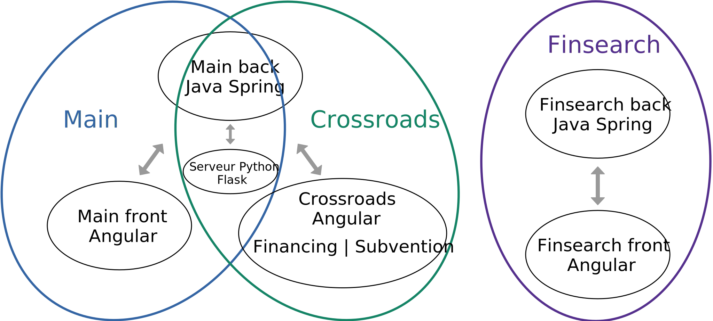
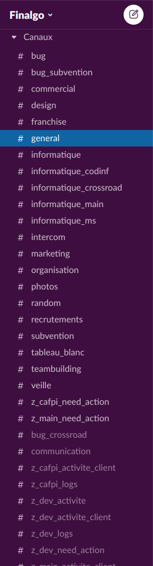
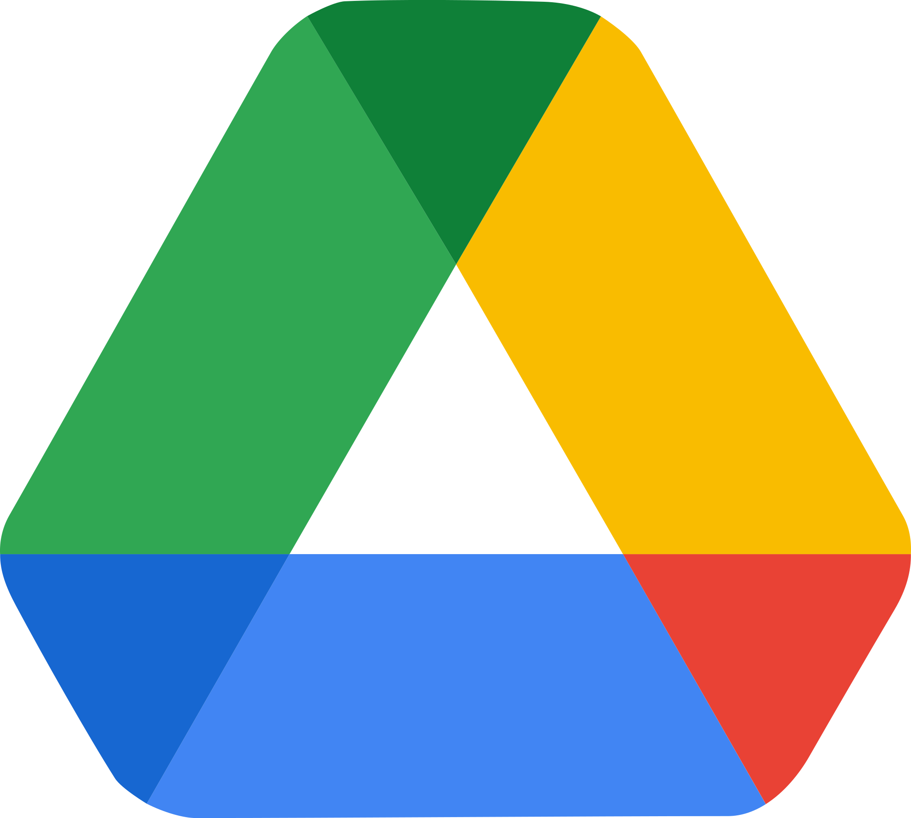
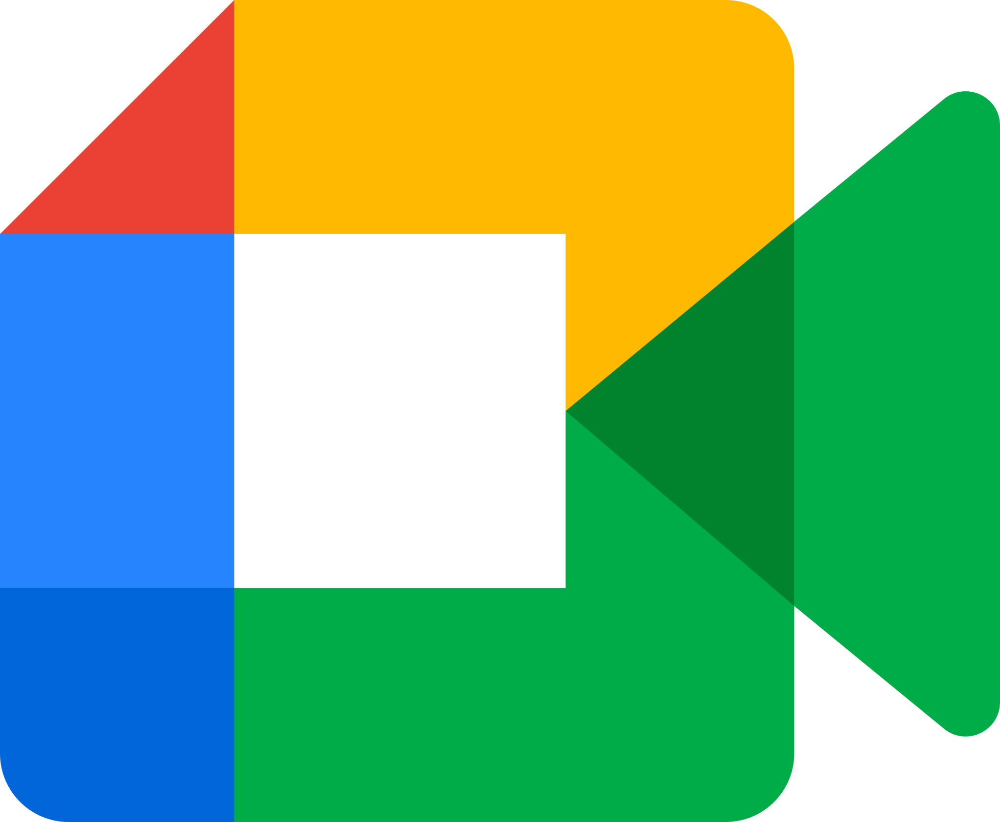
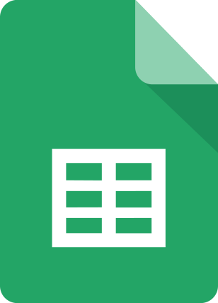

# Rapport final d'alternance

Ce document est un brouillon du rapport final.

## Page de garde

Titre :

> Rapport final d'alternance  
> développeur full stack  
> chez Finalgo

Petit encadré sur les deux dernières lignes du titre ?

Bloc "réalisé par / tuteurs"

> Réalisé par : Julien Giraud  
> Diplôme préparé : Master 1 Informatique  
> Tuteur entreprise : Bertrand Héllion  
> Tuteur pédagogique : Marc Plantevit  
> Durée : du 07/09/2020 au 30/08/2021 (1 an)

## Remerciements

Je tiens à remercier Bertrand Hellion de m'avoir accepté à Finalgo et accompagné tout au long de l'année. Je remercie Marc Plantevit de m'avoir suivi et conseillé. Je remercie également toute l'équipe Finalgo ainsi que les trois dernières générations de stagiaires et alternants pour m'avoir accueilli, intégré et partagé leur bonne humeur.

## Table des matières

- [Rapport final d'alternance](#rapport-final-dalternance)
  - [Page de garde](#page-de-garde)
  - [Remerciements](#remerciements)
  - [Table des matières](#table-des-matières)
  - [Introduction](#introduction)
  - [Présentation de Finalgo](#présentation-de-finalgo)
    - [L'équipe](#léquipe)
    - [Les projets](#les-projets)
  - [Environnement de travail](#environnement-de-travail)
    - [Matériel et lieu](#matériel-et-lieu)
    - [Outils et logiciels](#outils-et-logiciels)
      - [Slack](#slack)
      - [Asana](#asana)
      - [Google Workspace](#google-workspace)
  - [Environnement technique](#environnement-technique)
    - [Côté serveur](#côté-serveur)
    - [Côté client](#côté-client)
    - [Outils de développement](#outils-de-développement)
  - [Missions effectuées](#missions-effectuées)
    - [Mission 1 : Quoi ? Comment ? Pourquoi ?](#mission-1--quoi--comment--pourquoi-)
  - [Conclusion](#conclusion)

## Introduction

Dans le cadre de ma premire année de Master Informatique à l'UCBL j'ai opté pour un cursus en alternance au sein de Finalgo, une startup locale spécialisée dans les applications web en lien avec les financements.

J'ai pu effectuer cette alternance suite à mon stage optionnel de L3 réalisé au même endroit. Pour celle-ci, un contrat d'apprentissage de deux ans a été signé. Cette période correspond à un Master qui se termine par un diplôme dans les Technologies de l'Information et Web (TIW).

Les notions vues en cours lors de mon DUT et de ma Licence ainsi que mes précédentes expériences professionnelles m'ont beaucoup aidé à réaliser mes missions en entreprise.

Certaines missions ont renforcé mes connaissances, d'autres m'ont permi de comprendre des éléments abordés au cours de l'année dans un vrai cadre professionnel.

Tout au long de l'année j'ai réalisé des missions diverses sur l'ensemble des applications de Finalgo.

## Présentation de Finalgo

Finalgo est une startup familiale de 6 collaborateurs spécialisée dans

- la recherche de financements 100 % digitale,
- la construction et la gestion de dossiers de financement,
- la recherche de subventions.

Nous proposons à nos clients des outils qui permettent de répondre à ces besoins. Ces outils sont des applications web avec un système d'abonnement payant, il s'agit du modèle d'exploitation commerciale « SaaS » pour « Software as a Service ». Notre objetif est de leur permettre de construire et d’envoyer eux-même leurs dossiers de financements à tous types de partenaires financiers, ou de trouver les aides éligibles pour leur entreprise.

Notre vocation est de faciliter l'accès au financement pour les entrepreneurs, artisans, commerçants et plus généralement aux dirigeants de TPE / PME.

### L'équipe

À Finalgo la hiérarchie est complètement horizontale, pour chaque tâche le référent est la personne qui maîtrise le mieux la partie métier ou technique correspondante. L'organigramme est donc organisé suivant le type du contrat.

\* Non présents en même temps

### Les projets

Cette année j'ai participé au développement des quatre projets principaux de Finalgo,

- **Main** notre application de construction et de gestion de dossiers de financement,
- **Crossroads Financing** notre application de recherche de financements,
- **Crossroads Subvention** notre application de recherche de subventions,
- **Finsearch** une sorte de Main simplifié dont nous gérons le développement et la maintenance pour l'un de nos clients.

En terme de projets informatiques, chaque application possède un front\* Angular\* et un back\* Java Spring Boot\* qui fonctionne sous forme d'une API REST\*. Le back est le même pour Main et pour Crossroads, Finsearch possède un front et un back. Il y a également un petit serveur Python\* Flask\* qui communique avec le back de Main, ce qui fait au total 6 projets informatiques différents.

## Environnement de travail

### Matériel et lieu

À Finalgo nous travaillons beaucoup en télétravail. Lorsque nous allons dans les locaux, en général une fois par semaine pour les membres de l'équipe qui sont à proximité de Lyon, nous allons au HUB612. Il s'agit d'un incubateur, une sorte d'open space avec une équipe qui accompagne les entreprises. Le HUB612 est spécialisé dans les entreprises qui travaillent sur la finance, les assurances et le marketing à l'aide d'outils numériques modernes. C'est un lieu agréable pour travailler et échanger avec des personnes dans des domaines similaires aux nôtres.

Pour travailler on a mis à ma disposition un ordinateur portable avec une très bonne configuration, ce qui me permet d'utiliser efficacement tous les logiciels dont j'ai besoin. J'utilise généralement un deuxième écran pour des questions de confort, il y en a sur les bureaux du HUB* et j'utilise mon écran personnel en télétravail.

### Outils et logiciels

Depuis le début de la crise sanitaire, toute notre organisation est basée sur du travail en distanciel. Nous sommes donc équipés en outils de communication, visioconférence, gestion des tâches et suite de bureautique.

#### Slack

 Slack est notre outil de communication n°1 interne comme externe.

En **interne** nous avons un espace de travail "Finalgo" avec des **canaux de discussion** pour tous les sujets, ce qui permet de configurer les notifications qu'on souhaite recevoir pour chaque type d'information.

Il y a un canal pour

- chaque **projet** : Main, Crossroads
- chaque **domaine** : informatique, marketing, communication, design, recrutement, teambuilding…
- chaque **type de logs** : bugs utilisateurs, boutons "demander de l'aide", actions utilisateurs, actions nécesitant une intervention de notre part, traces des différents serveurs de production et de développement…
- la **détente** : on y trouve des blagues ou liens en tout genre pour partager de la bonne humeur avec l'équipe.

En **externe** nous avons un espace de travail pour chaque client, au sens entreprise qui utilise l'une de nos applications et qui a demandé un développement spécifique.

#### Asana

 Asana est notre plateforme de gestion des tâches.

La plateforme permet de créer des projets qui fonctionnent comme les tableaux sur
Trello. Il est possible d'y créer des colonnes et d'y ajouter des tâches avec des attributions, des images, des sous-tâches.

Nous utilisons ces tableaux pour remplacer le **Scrum Board**, un tableau de post-it utilisé par la méthode SCRUM qui est à l'origine de notre méthode de travail. Grâce à ces tableaux nous pouvons voir qui travail sur une tâche, connaître son avancement, en ajouter nous-même et écrire les spécification. Il y a beaucoup plus de fonctionnalités sur le site mais nous ne les utilisons pas pour le moment.

#### Google Workspace

 |  |  |  |  |  |
| ----- | ----- | ---- | -------- | ----- | ------ |
| Gmail | Drive | Meet | Calendar | Sites | Sheets |

Finalgo utilise un système de comptes Google pour les entreprises. Nos comptes nous permettent d'accéder à la suite de bureautique comme avec une adresse **Gmail** classique, même s'ils terminent par `@finalgo.fr`. Toutes ces applications sont liées à un espace partagé sur **Google Drive**, auquel nous avons tous accès avec notre compte.

**Meet** est une plateforme de réunions numériques très simple à utiliser. Il est possible de se connecter à un salon grâce à un lien, on peut ensuite participer avec sa caméra, son micro ou en faisant des partages d'écran. Nous passons beaucoup de temps sur Meet, surtout pour parler avec l'équipe mais aussi pour les réunions clients.

**Calendar** est un agenda, il sert surtout à planifier des rendez-vous clients ou des points d'équipe importants. Un salon meet est associé à chaque événement de l'agenda. Ce système évite de générer un lien et de l'envoyer aux invités, il suffit de les ajouter sur un événement.

**Google Sites** sert exclusivement à voir et alimenter notre wiki interne. Il s'agit d'un site accessible uniquement avec notre compte, sur lequel nous répertorions toutes sortes d'informations utiles pour Finalgo. On y trouve les procédures comme les mises en production, les installations, les plateformes et il y a des explications sur les technologie inhabituelles. C'est un outil que nous utilisons et alimentons beaucoup, il entre dans la philosophie SCRUM en facilitant les formations mutuelles au sein de l'équipe.

**Sheets** est un tableur comme Excel, nous l'utilisons en interne et en externe. Il y a des tableaux administratifs pour gérer des choses comme les congés, certains servent d'outils de maintenance et ticketing, d'autres permettent de synthétiser des informations afin de les exporter dans le code.

## Environnement technique

Meet est une plateforme de réunions numériques très simple à utiliser. Il est possible de se connecter à un salon grâce à un lien, on peut ensuite participer avec sa caméra, son micro ou en faisant des partages d'écran. Nous passons beaucoup de temps sur Meet, surtout pour parler avec l'équipe mais aussi pour les réunions clients.

Calendar est un agenda, il sert surtout à planifier des rendez-vous clients ou des points d'équipe importants. Un salon meet est associé à chaque événement de l'agenda. Ce système évite de générer un lien et de l'envoyer aux invités, il suffit de les ajouter sur un événement.

Google Sites sert exclusivement à voir et alimenter notre wiki interne. Il s'agit d'un site accessible uniquement avec notre compte, sur lequel nous répertorions toutes sortes d'informations utiles pour Finalgo. On y trouve les procédures comme les mises en production, les installations, les plateformes et il y a des explications sur les technologie inhabituelles. C'est un outil que nous utilisons et alimentons beaucoup, il entre dans la philosophie SCRUM en facilitant les formations mutuelles au sein de l'équipe.

Sheets est un tableur comme Excel, nous l'utilisons en interne et en externe. Il y a des tableaux administratifs pour gérer des choses comme les congés, certains servent d'outil de maintenance et ticketing, d'autres permettent de synthétiser des informations afin de les exporter dans le code.

## Missions effectuées

### Mission 1 : Quoi ? Comment ? Pourquoi ?

## Conclusion
