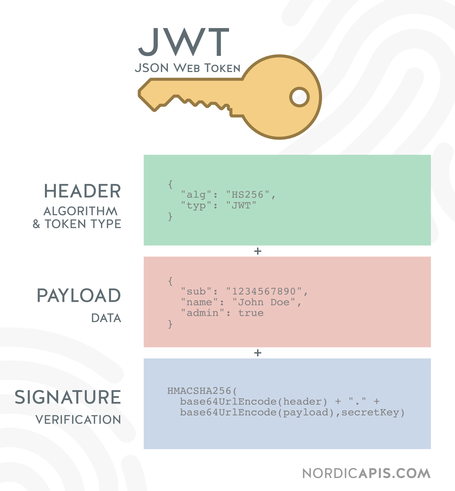

# Rapport final d'alternance

Ce document est un brouillon du rapport final.

## Page de garde

Titre :

> Rapport final d'alternance  
> développeur full stack  
> chez Finalgo

Petit encadré sur les deux dernières lignes du titre ?

Bloc "réalisé par / tuteurs"

> Réalisé par : Julien Giraud  
> Diplôme préparé : Master 1 Informatique  
> Tuteur entreprise : Bertrand Héllion  
> Tuteur pédagogique : Marc Plantevit  
> Durée : du 07/09/2020 au 30/08/2021 (1 an)

## Remerciements

Je tiens à remercier Bertrand Hellion de m'avoir accepté à Finalgo et accompagné tout au long de l'année. Je remercie Marc Plantevit de m'avoir suivi et conseillé. Je remercie également toute l'équipe Finalgo ainsi que les trois dernières générations de stagiaires et alternants pour m'avoir accueilli, intégré et partagé leur bonne humeur.

## Table des matières

- [Rapport final d'alternance](#rapport-final-dalternance)
  - [Page de garde](#page-de-garde)
  - [Remerciements](#remerciements)
  - [Table des matières](#table-des-matières)
  - [Introduction](#introduction)
  - [Présentation de Finalgo](#présentation-de-finalgo)
    - [L'équipe](#léquipe)
    - [Les projets](#les-projets)
  - [Environnement de travail](#environnement-de-travail)
    - [Matériel et lieu](#matériel-et-lieu)
    - [Outils et logiciels](#outils-et-logiciels)
      - [Slack](#slack)
      - [Asana](#asana)
      - [Google Workspace](#google-workspace)
  - [Environnement technique](#environnement-technique)
    - [Côté serveur](#côté-serveur)
    - [Côté client](#côté-client)
    - [Outils de développement](#outils-de-développement)
  - [Missions effectuées](#missions-effectuées)
    - [Écran d'administration de Finsearch](#écran-dadministration-de-finsearch)
    - [Ajout de la connexion SSO sur Main et sur Crossroads](#ajout-de-la-connexion-sso-sur-main-et-sur-crossroads)
      - [SSO Microsoft Azure sur Main](#sso-microsoft-azure-sur-main)
      - [SSO Google et Quickbooks sur Crossroads](#sso-google-et-quickbooks-sur-crossroads)
        - [Avant de commencer le développement spécifique au SSO](#avant-de-commencer-le-développement-spécifique-au-sso)
        - [Préparation du front](#préparation-du-front)
        - [Travail réalisé pour Google](#travail-réalisé-pour-google)
        - [Travail réalisé pour Quickbooks](#travail-réalisé-pour-quickbooks)
        - [Généricité du code en back](#généricité-du-code-en-back)
        - [Retours sur la mission du SSO](#retours-sur-la-mission-du-sso)
  - [Conclusion](#conclusion)

## Introduction

Dans le cadre de ma premire année de Master Informatique à l'UCBL j'ai opté pour un cursus en alternance au sein de Finalgo, une startup locale spécialisée dans les applications web en lien avec les financements.

J'ai pu effectuer cette alternance suite à mon stage optionnel de L3 réalisé au même endroit. Pour celle-ci, un contrat d'apprentissage de deux ans a été signé. Cette période correspond à un Master qui se termine par un diplôme dans les Technologies de l'Information et Web (TIW).

Les notions vues en cours lors de mon DUT et de ma Licence ainsi que mes précédentes expériences professionnelles m'ont beaucoup aidé à réaliser mes missions en entreprise.

Certaines missions ont renforcé mes connaissances, d'autres m'ont permi de comprendre des éléments abordés au cours de l'année dans un vrai cadre professionnel.

Tout au long de l'année j'ai réalisé des missions diverses sur l'ensemble des applications de Finalgo.

## Présentation de Finalgo

Finalgo est une startup familiale de 6 collaborateurs spécialisée dans

- la recherche de financements 100 % digitale,
- la construction et la gestion de dossiers de financement,
- la recherche de subventions.

Nous proposons à nos clients des outils qui permettent de répondre à ces besoins. Ces outils sont des applications web avec un système d'abonnement payant, il s'agit du modèle d'exploitation commerciale « SaaS » pour « Software as a Service ». Notre objetif est de leur permettre de construire et d’envoyer eux-même leurs dossiers de financements à tous types de partenaires financiers, ou de trouver les aides éligibles pour leur entreprise.

Notre vocation est de faciliter l'accès au financement pour les entrepreneurs, artisans, commerçants et plus généralement aux dirigeants de TPE / PME.

### L'équipe

À Finalgo la hiérarchie est complètement horizontale, pour chaque tâche le référent est la personne qui maîtrise le mieux la partie métier ou technique correspondante. L'organigramme est donc organisé suivant le type du contrat.


\* Non présents en même temps

### Les projets

Cette année j'ai participé au développement des quatre projets principaux de Finalgo,

- **Main** notre application de construction et de gestion de dossiers de financement,
- **Crossroads Financing** notre application de recherche de financements,
- **Crossroads Subvention** notre application de recherche de subventions,
- **Finsearch** une sorte de Main simplifié dont nous gérons le développement et la maintenance pour l'un de nos clients.

En terme de projets informatiques, chaque application possède un front\* Angular\* et un back\* Java Spring Boot\* qui fonctionne sous forme d'une API REST\*. Le back est le même pour Main et pour Crossroads, Finsearch possède un front et un back. Il y a également un petit serveur Python\* Flask\* qui communique avec le back de Main, ce qui fait au total 6 projets informatiques différents.


## Environnement de travail

### Matériel et lieu

À Finalgo nous travaillons beaucoup en télétravail. Lorsque nous allons dans les locaux, en général une fois par semaine pour les membres de l'équipe qui sont à proximité de Lyon, nous allons au HUB612. Il s'agit d'un incubateur, une sorte d'open space avec une équipe qui accompagne les entreprises. Le HUB612 est spécialisé dans les entreprises qui travaillent sur la finance, les assurances et le marketing à l'aide d'outils numériques modernes. C'est un lieu agréable pour travailler et échanger avec des personnes dans des domaines similaires aux nôtres.

Pour travailler on a mis à ma disposition un ordinateur portable avec une très bonne configuration, ce qui me permet d'utiliser efficacement tous les logiciels dont j'ai besoin. J'utilise généralement un deuxième écran pour des questions de confort, il y en a sur les bureaux du HUB* et j'utilise mon écran personnel en télétravail.

### Outils et logiciels

Depuis le début de la crise sanitaire, toute notre organisation est basée sur du travail en distanciel. Nous sommes donc équipés en outils de communication, visioconférence, gestion des tâches et suite de bureautique.

#### Slack

 Slack est notre outil de communication n°1 interne comme externe.


En **interne** nous avons un espace de travail "Finalgo" avec des **canaux de discussion** pour tous les sujets, ce qui permet de configurer les notifications qu'on souhaite recevoir pour chaque type d'information.

Il y a un canal pour

- chaque **projet** : Main, Crossroads
- chaque **domaine** : informatique, marketing, communication, design, recrutement, teambuilding…
- chaque **type de logs** : bugs utilisateurs, boutons "demander de l'aide", actions utilisateurs, actions nécesitant une intervention de notre part, traces des différents serveurs de production et de développement…
- la **détente** : on y trouve des blagues ou liens en tout genre pour partager de la bonne humeur avec l'équipe.

En **externe** nous avons un espace de travail pour chaque client, au sens entreprise qui utilise l'une de nos applications et qui a demandé un développement spécifique.

#### Asana

 Asana est notre plateforme de gestion des tâches.

La plateforme permet de créer des projets qui fonctionnent comme les tableaux sur
Trello. Il est possible d'y créer des colonnes et d'y ajouter des tâches avec des attributions, des images, des sous-tâches.

Nous utilisons ces tableaux pour remplacer le **Scrum Board**, un tableau de post-it utilisé par la méthode SCRUM qui est à l'origine de notre méthode de travail. Grâce à ces tableaux nous pouvons voir qui travail sur une tâche, connaître son avancement, en ajouter nous-même et écrire les spécification. Il y a beaucoup plus de fonctionnalités sur le site mais nous ne les utilisons pas pour le moment.

#### Google Workspace

 |  |  |  |  |  |
| ----- | ----- | ---- | -------- | ----- | ------ |
| Gmail | Drive | Meet | Calendar | Sites | Sheets |

Finalgo utilise un système de comptes Google pour les entreprises. Nos comptes nous permettent d'accéder à la suite de bureautique comme avec une adresse **Gmail** classique, même s'ils terminent par `@finalgo.fr`. Toutes ces applications sont liées à un espace partagé sur **Google Drive**, auquel nous avons tous accès avec notre compte.

**Meet** est une plateforme de réunions numériques très simple à utiliser. Il est possible de se connecter à un salon grâce à un lien, on peut ensuite participer avec sa caméra, son micro ou en faisant des partages d'écran. Nous passons beaucoup de temps sur Meet, surtout pour parler avec l'équipe mais aussi pour les réunions clients.

**Calendar** est un agenda, il sert surtout à planifier des rendez-vous clients ou des points d'équipe importants. Un salon meet est associé à chaque événement de l'agenda. Ce système évite de générer un lien et de l'envoyer aux invités, il suffit de les ajouter sur un événement.

**Google Sites** sert exclusivement à voir et alimenter notre wiki interne. Il s'agit d'un site accessible uniquement avec notre compte, sur lequel nous répertorions toutes sortes d'informations utiles pour Finalgo. On y trouve les procédures comme les mises en production, les installations, les plateformes et il y a des explications sur les technologie inhabituelles. C'est un outil que nous utilisons et alimentons beaucoup, il entre dans la philosophie SCRUM en facilitant les formations mutuelles au sein de l'équipe.

**Sheets** est un tableur comme Excel, nous l'utilisons en interne et en externe. Il y a des tableaux administratifs pour gérer des choses comme les congés, certains servent d'outils de maintenance et ticketing, d'autres permettent de synthétiser des informations afin de les exporter dans le code.

## Environnement technique

### Côté serveur

Pour les serveurs nous avons un compte sur la plateforme OVH avec une dizaine de VPS (virtual private server) sous Debian.

Sur ces VPS nous avons un serveur Apache pour servir le front compilé par Angular et un serveur Tomcat pour le back Java Spring Boot.

Dans le cadre de Main il y a aussi un serveur Flask sur Python 3.8.

Nos projets Spring Boot utilisent Java version 11 avec divers dépendances. Voici un résumé des plus utilisées et de celles que j'ai utilisées.

| Dépendance | Description |
| ---------- | ----------- |
| Auth0 | Librairie qui permet de manipuler les JWT. |
| ClamAV | Librairie qui permet de communiquer avec le logiciel ClamAV installé sur la machine. |
| Hibernate / HQL | Framework qui permet de manipuler la base de données à travers des interfaces. Il implémente le HQL, un langage de requête de base de données relationnelles similaire à SQL avec une approche orientée objet. |
| Itextpdf | Librairie payante qui permet de manipuler les PDF et d'en générer à partir de code HTML. |
| Sendinblue | Librairie qui permet de communiquer avec l'API de Sendinblue, un service web d'envoi d'email orienté marketing. |
| Stripe | Librairie qui permet de communiquer avec l'API de Stripe, un service web de paiement en ligne. |
| Swagger | Une interface qui permet de visualiser l'architectures d'une API et d'y envoyer des requêtes. |

Il y a d'autres programmes installés sur les serveurs, les plus importants sont les suivants.

ClamAV : logiciel antivirus open source compatible Linux et MacOS.

Mysql : système de gestion de bases de données relationnelles.

Python : langage de programmation orienté objet de haut niveau.

Cron : programme qui permet de programmer l'exécution de scripts ou de logiciels sur Linux.

### Côté client

En front nous utilisons Angular 11, un framework open source de Google basé sur le langage TypeScript. Le code HTML Angular utilise une syntaxe enrichie par rapport au HTML5, il est possible d'y insérer des éléments de code. Il y a également une prise en charge du langage Saas qui permet de simplifier la syntaxe du CSS. Nous utilisons la version SCSS de Saas car sa syntaxe inclue celle du CSS.

TypeScript est un langage de programmation libre et open source de Microsoft. Ce langage est basé sur Javascript avec un système de typage, de classes et d'éritage similaire à celui de Java. Il est possible de convertir du code TypeScript en code Javascript.

Notre projet Angular utilise divers dépendances. Voici un résumé des plus utilisées.

| Dépendance | Description |
| ---------- | ----------- |
| Bootstrap | Ensemble de classes CSS qui permettent de simplifier la mise en place du responsive design. |
| Forms | Ensemble de Classes et composants Angular qui permettent de gérer les formulaires. |
| HelpHero | Librairie qui permet de créer des product tour à partir d'une interface web. |
| Material | Ensemble de classes et composants Angular qui permettent de créer des interfaces graphiques d'application très facilement. |
| Router | Ensemble de classes et composants Angular qui permettent de gérer les routes d'une application et de manipuler l'URL. |
| SweetAlert2 | Librairie qui permet d'afficher toutes sortes de pop-up personalisables. |

### Outils de développement

De façon générale il y a beaucoup d'informations utiles pour le développement sur notre wiki. On y trouve notamment :

mettre exemple page wiki annexe

- les commandes à utiliser pour installer MySQL sur notre machine et y charger une copie de la base de données de production,
- la procédure à suivre pour tester le paiement par Stripe depuis notre environnement de développement local,
- la procédure à suivre pour faire une mise en production du back ou du front,
- les commandes à utiliser pour récupérer les logs des différentes applications de la production.

Pour développer en front j'utilise Visual Studio Code comme IDE. Il s'agit d'un éditeur de code sur lequel on peut ajouter divers extensions pour simplifier le développement, notamment sur Angular. J'utilise également beaucoup les outils de développement de Google Chrome, dont le débugger permet de suivre l'éxécution du code TypeScript.

Pour le back j'utilise l'IDE IntelliJ qui est très efficace pour le Java. J'utilise beaucoup le débugger de cet IDE, à la fois pour visualiser l'exécution du code ligne par ligne mais aussi pour tester en direct du code Java.

Ajouter 2 annexes pour le débugger intellij

Lorsque nous avons besoin d'accéder aux derniers logs d'une application possiblement en production nous pouvons directement utiliser les channels Slack correspondants à chacun des types de logs. Nous en avons une douzaine au total, il y en a un pour :

- chaque serveur tomcat de production comme de développement (Ti),
- la totalité des logs (Ti,1),
- toutes les actions utilisateur (Ti,2)
- tout ce qui nécessite notre intervention (Ti,3).

Pour tous nos projets nous utilisons GIT comme gestionnaire de version et le code est sauvegardé en ligne sur GitHub. Nous avons tous un compte sur cette plateforme et nous avons les droits d'accès sur les différents projets, par défaut ils sont inaccessibles.  
Pour gérer les commits et les branches j'utilise une extension de Visual Studio Code qui propose une excellente interface graphique. Cette interface permet d'effectuer toute sorte d'opération très facilement, en particulier de ne commiter que certaines lignes de code dans un fichier ou de visualiser les différences entre les commits.

Mettre dans annexe


Enfin pour travailler sur les bases de données nous utilisons DBeaver, un logiciel libre avec une interface plutôt intuitive.


## Missions effectuées

### Écran d'administration de Finsearch

Le projet Finsearch était en plein développement lorsque je suis arrivé à Finalgo. L'une de mes premières missions était de réaliser l'écran d'administration des projets pour le personnel de Cefin, l'entreprise à l'origine du projet Finsearch. Cet écran permet aux administrateurs de voir tous les dossiers en cours de traitement par l'application, avec divers informations sur chaque dossier.

En front l'écran n'est accessible pour les utilisateurs administrateurs. Il affiche un tableau dont chaque ligne récapitule l'avancement d'un utilisateur dans la gestion de son plan de financement, voir annexe. Il est possible de trier le tableau à partir de ses colonnes et l'administrateur peut se connecter sur le compte d'un utilisateur pour voir son dossier à partir de sa ligne dans le tableau, voir annexe.

annexes  

En back il a fallu récupérer les différentes informations à afficher. Certaines étaient liées à l'utilisateur, d'autres aux projets de cet utilisateur. Il y a un traitement pour ne récupérer que les informations les plus importantes afin de n'afficher qu'une ligne par utilisateur.

Cet écran était la dernière étape pour le projet Finsearch soit utilisable par Cefin.

### Ajout de la connexion SSO sur Main et sur Crossroads

Dans le cadre d'un développement spécifique de Main et de l'amélioration des produits Crossroads, je me suis occupé de toutes les tâches relatives au Single Sign-On aussi appelé SSO. Il s'agit de la technologie à l'origine des boutons *Se connecter avec Google ou Facebook*. L'objectif de ces tâches est donc de permettre aux utilisateurs de se connecter sur nos plateformes à partir de leurs comptes déjà existants sur d'autres plateformes, en l'occurence Google, Quickbooks et Microsoft Azure.

Personne n'avait développé ce type de fonctionnalité dans les projets de Finalgo, je me suis donc chargé d'écrire la page SSO sur notre wiki interne pour expliquer son fonctionnement et lister les liens utiles.

Afin de mieux comprendre le processus de connexion il faut savoir que pour être connecté, notre front doit avoir récupérer l'utilisateur courrant ainsi qu'un JWT valide depuis notre back.

#### SSO Microsoft Azure sur Main

J'ai commencé par implémenter une connexion SSO sur Main dans le cadre d'un développement spécifique pour notre client Cafpi. Leur entreprise utilise la suite Microsoft Azure qui permet la mise en place du SSO pour ses utilisateurs.

Dans le cadre de cette tâche tous les comptes existaient déjà sur Main, autrement dit la question de la création de compte ne se posait pas. Le travail à réaliser était d'ajouter une page de connexion qui se charge de récupérer un JWT Microsoft Azure, puis qui s'en serve pour récupérer l'utilisateur et un JWT Finalgo auprès du back afin de connecter l'utilisateur. En back il fallait donc être capable de vérifier ce nouveau type de JWT.


Pour le front Microsoft fournit une librairie qui permet de gérer le processus de connexion SSO, c'est à dire la redirection vers le site où se connecte l'utilisateur et la récupération du JWT suite à cette connexion. Il suffit de fournir divers identifiants de configuration à la librairie et elle se charge de nous retourner le JWT.

En back il n'était pas possible d'utiliser les librairies de SSO pour des raisons de conflit avec le système de connexion normal. Le plus simple était de faire une vérification manuelle. Pour ce faire il faut récupérer la clé publique du JWT sur l'API de Microsoft afin de vérifier la signature. Le problème se complique car il y a plusieurs clés sur l'API en question, afin d'identifier la bonne clé il faut utiliser un code appelé identifiant du token ou kid, ce code se trouve à l'intérieur du JWT. Une fois la clé récupérée il faut effectuer divers conversions afin de pouvoir vérifier la signature du JWT, ce qui équivaut à vérifier sa validité.



> <https://nordicapis.com/why-cant-i-just-send-jwts-without-oauth/>

La figure XXX montre la structure du JWT et explique comment générer la signature à partir du contenu et de l'algorithme utilisé. Pour Microsoft le `kid` se trouve dans le header du JWT et l'algorithme utilisé est RSA qui repose sur un système de clé asymétriques, d'où le besoin de récupérer une clé publique. L'identifiant unique des utilisateur se trouve dans le payload, il s'agit de leur adresse email.

#### SSO Google et Quickbooks sur Crossroads

Dans le cadre de l'amélioration de la plateforme Crossroads nous avions besoin d'ajouter la connexion SSO depuis les plateformes Google et Quickbooks. Pour cette tâche il fallait gérer la création de compte en plus de la connexion. D'un point de vue produit le but était d'augmenter le taux de conversion des utilisateurs sur la page de création de compte. Autrement dit d'augmenter le nombre de création de compte par rapport au nombre de visiteurs de la page. D'un point de vue technique l'idée était de réutiliser le SSO de Cafpi et d'en faire un système générique qui permette d'ajouter facilement une nouvelle plateforme de SSO.

##### Avant de commencer le développement spécifique au SSO

Pour mettre en place une connexion par SSO il faut effectuer une manipulation sur la plateforme de connexion, ici Google et Quickbooks. Les plateformes fournissent une interface qui permet de configurer une application afin d'obtenir divers identifiants. Voir annexes sso_google_interface et sso_quickbooks_interface. La configuration permet à la plateforme d'identifier les serveurs et adresses à informer en cas de connexion, les identifiants nous permettent d'indiquer aux plateformes à quelle application nous souhaitons nous connecter.

 

##### Préparation du front

J'ai crée un composant dans le but de réunir tout le code relatif aux connexions SSO.

Dans un premier temps ce composant s'occupe d'afficher les boutons de connexions et relie chaque bouton à une méthode de connexion spécifique à la plateforme. Voir annexe 

Étant donné que nous avons plusieurs systèmes de connexions différents j'ai eu besoin de modifier le composant afin qu'il détecte les JWT dans l'URL. Le but de cette démarche était de déclencher le processus de connexion de notre front suite à une connexion SSO de l'utilisateur. En effet, après une connexion par SSO l'utilisateur est redirigé sur notre back qui le renvoit sur la page de connexion avec un JWT Finalgo en paramètre de l'URL. Ce processus permet de lancer la récupération de l'utilisateur courant qui permet de connecter l'utilisateur. Voir annexe 


##### Travail réalisé pour Google

En front Google fourni une librairie similaire à celle de Microsoft Azure. Il suffit de lui fournir quelques identifiants et elle se charge de rediriger les utilisateurs sur leur page de connexion. Une fois connectés j'ai configuré Google pour les rediriger sur une API de notre back `/oauth2/redirectGoogle`. À ce moment là, le JWT Google est dans l'URL.

En back j'ai utilisé un système similaire à Microsoft Azure pour vérifier la validité du JWT et récupérer les informations qu'il contient, notament l'email de l'utilisateur qui sert d'identifiant unique. Ensuite j'ai géré l'éventuelle création de compte, qui était normalement sur une autre API. Puis j'ai redirigé les utilisateurs sur la page de connexion avec un nouveau JWT dans l'URL pour que le front termine sa connexion.

##### Travail réalisé pour Quickbooks

Pour Quickbooks il y a une librairie Java qui permet de fortement simplifier l'implémentation du SSO. En front j'ai simplement redirigé l'utilisateur sur une API du back `connectToQuickbooks` qui se charge de faire tout le travail.

En back cette première API se charge de générer un identifiant unique à la connexion et de rediriger les utilisateurs sur leur page de connexion à l'aide de la librairie fournie. Ensuite Quickbooks est configuré pour rediriger les utilisateurs sur une deuxième API du back `redirectQuickbooks` avec le même code unique et un token spécifique à Quickbooks dans l'URL. Ce token est similaire à un JWT, la librairie de Quickbooks permet d'en extraire des informations sur l'utilisateur. Après vérification du code, l'API se charge de l'éventuelle création de compte puis redirige l'utiisateur sur le front avec un nouveau JWT dans l'URL qui permet de terminer la connexion.

##### Généricité du code en back

En terme de généricité j'ai réussi factorisé le fonctionnement des trois types de SSO en déplaçant tout ce qui est spécifique à chaque plateforme dans une sorte de fichier de configuration.

Pour les besoins du fichier de configuration j'ai choise une classe Java de type Enum, comme il est coutume à Finalgo.  
Cet enum contient pour chaque type de SSO :

- l'URL vers l'API des clés publiques au format JSON,
- le chemin à utiliser pour trouver la bonne clé dans ce JSON à partir du kid,
- les clés à utiliser pour récupérer l'email dans le token,
- un booléen pour indiquer si le texte de la clé publique est encodé en Base64 ou non.

Afin de pouvoir mettre le chemin à utiliser pour récupérer l'information dans le JSON j'ai crée une méthode qui permette d'utiliser ce chemin. Ma méthode prend en entrée un objet de type JSON, un chemin au format texte similaire à XPath et elle retourne en sortie le sous-élément du JSON correspondant au chemin. Voir annexe

annexe

```java
/**
  * Retourne une propriété dans un objet JSON à partir de son chemin.
  *
  * @param root l'objet JSON qui contient la propriété
  * @param path le chemin : property1/?property2forArrays=key/property3/index/...
  * @return la propriété ou null si le chemin est incorrect
  */
public static Object getJsonObjectFromPath(JSONObject root, String path) {
    try {
        Object node = root;
        for (String key : path.split("/")) {
            if (key.matches("[0-9]+")) { // Index de tableau
                node = ((JSONArray) node).get(Integer.parseInt(key));
                continue;
            }
            if (!key.startsWith("?")) { // Nom de propriété
                node = ((JSONObject) node).get(key);
                continue;
            }
            // Tableau d'objets avec filtre sur une propriété de ses éléments
            String subKey = key.split("=")[0].substring(1);
            String subValue = key.split("=")[1];
            for (Integer i = 0; i < ((JSONArray) node).length(); i++) {
                JSONObject child = ((JSONArray) node).getJSONObject(i);
                if (child.keySet().contains(subKey) && child.get(subKey).equals(subValue)) {
                    node = child;
                    break;
                }
            }
        }
        return node;
    } catch (Exception e) {
        return null;
    }
}
```

```json
Donnée JSON :
{
  "keys": [
    {
      "kid": "1",
      "password": "1234"
    },
    {
      "kid": "2",
      "password": "4321"
    }
  ]
}

Chemin :
keys/?kid=2/password

Résultat de la méthode appliquée à la donnée et au chemin :
"4321"
```

Grâce à cet enum Java, voir annexe, j'ai pu très fortement réduire le code qui permet de récupérer la clé publique d'un token, vérifier sa validité et récupérer les informations d'un utilisateur. L'ajout d'une nouvelle plateforme de SSO nécessitera un minimum de travail.

annexe

```Java
AZURE(
    "https://login.microsoftonline.com/{appId}/discovery/v2.0/keys",
    "keys/?kid=%s/x5c/0", // Le `%s` est remplacé par la valeur de `kid`
    true, // Il faut utiliser un décodeur de Base64
    Arrays.asList("unique_name", "upn") // Le premier à donner un résultat sera bon
),
GOOGLE(
    "https://www.googleapis.com/oauth2/v1/certs",
    "%s",
    false,
    Arrays.asList("email")
)
```

##### Retours sur la mission du SSO

Avec du recul il n'était pas nécessaire de lancer le processus de récupération de l'utilisateur en front, ce fonctionnement était inspiré du travail sur Cafpi dans lequel la plateforme de SSO redirige l'utilisateur sur la page de connexion avec le JWT dans l'URL. Ici il aurait été plus simple de transmettre l'utilisateur courrant directement en paramètre de l'URL avec le JWT.

Pour la récupération d'une donnée dans un objet JSON à partir d'un chemin j'ai réinventé le JSONPath qui répond déjà au problème de manière plus efficace que ma solution. Je ne savais pas que ce langage existait lorsque j'ai travaillé sur cette tâche, si c'était à refaire j'utiliserais une implémentation Java de JSONPath pour répondre à ce problème.

## Conclusion
