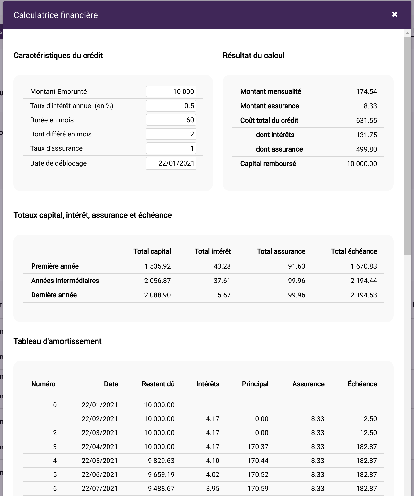
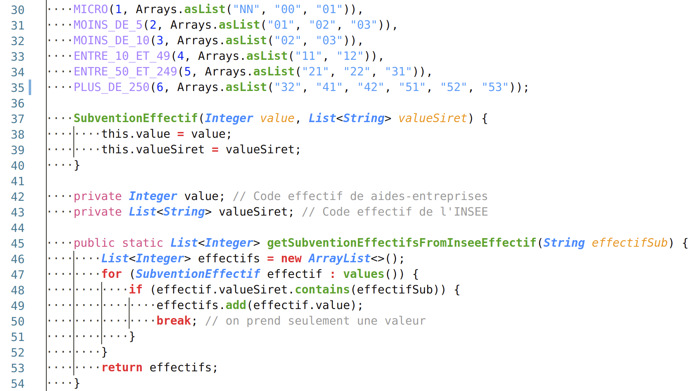
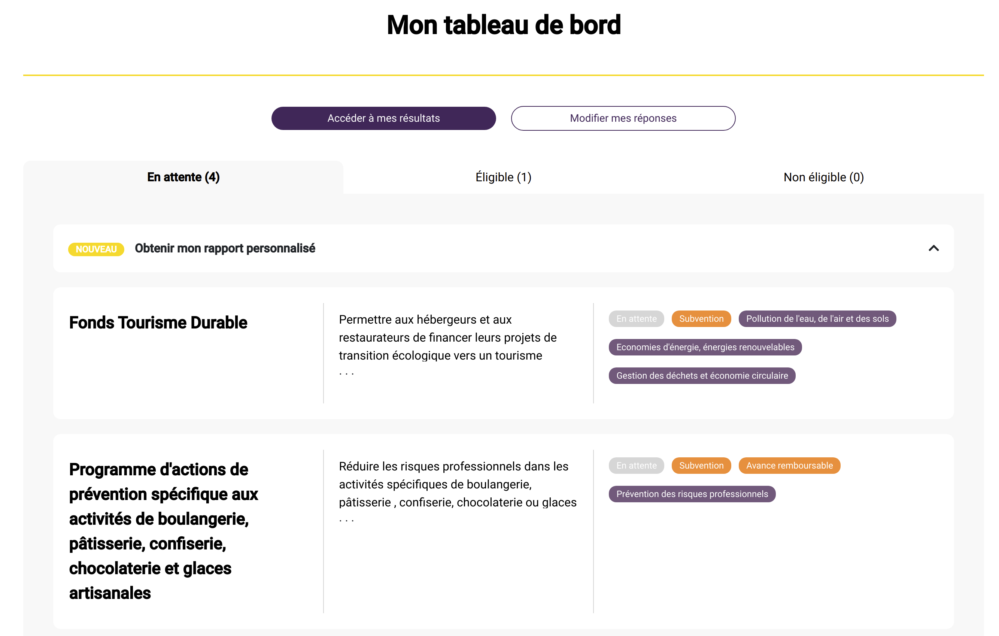

# Rapport final d'alternance

Ce document est un brouillon du rapport final.

## Page de garde

Titre :

> Rapport final d'alternance  
> développeur full stack  
> chez Finalgo

Petit encadré sur les deux dernières lignes du titre ?

Bloc "réalisé par / tuteurs"

> Réalisé par : Julien Giraud  
> Diplôme préparé : Master 1 Informatique  
> Tuteur entreprise : Bertrand Héllion  
> Tuteur pédagogique : Marc Plantevit  
> Durée : du 07/09/2020 au 30/08/2021 (1 an)

## Remerciements

Je tiens à remercier Bertrand Hellion de m'avoir accepté à Finalgo et accompagné tout au long de l'année. Je remercie Marc Plantevit de m'avoir suivi et conseillé. Je remercie également toute l'équipe Finalgo ainsi que les trois dernières générations de stagiaires et alternants pour m'avoir accueilli, intégré et partagé leur bonne humeur.

## Table des matières

- [Rapport final d'alternance](#rapport-final-dalternance)
  - [Page de garde](#page-de-garde)
  - [Remerciements](#remerciements)
  - [Table des matières](#table-des-matières)
  - [Introduction](#introduction)
  - [Présentation de Finalgo](#présentation-de-finalgo)
    - [L'équipe](#léquipe)
    - [Les projets](#les-projets)
  - [Environnement de travail](#environnement-de-travail)
    - [Matériel et lieu](#matériel-et-lieu)
    - [Outils et logiciels](#outils-et-logiciels)
      - [Slack](#slack)
      - [Asana](#asana)
      - [Google Workspace](#google-workspace)
  - [Environnement technique](#environnement-technique)
    - [Côté serveur](#côté-serveur)
    - [Côté client](#côté-client)
    - [Outils de développement](#outils-de-développement)
  - [Missions effectuées](#missions-effectuées)
    - [Écran d'administration de Finsearch](#écran-dadministration-de-finsearch)
    - [Ajout de la connexion SSO sur Main et sur Crossroads](#ajout-de-la-connexion-sso-sur-main-et-sur-crossroads)
      - [SSO Microsoft Azure sur Main](#sso-microsoft-azure-sur-main)
      - [SSO Google et Quickbooks sur Crossroads](#sso-google-et-quickbooks-sur-crossroads)
        - [Avant de commencer le développement spécifique au SSO](#avant-de-commencer-le-développement-spécifique-au-sso)
        - [Préparation du front](#préparation-du-front)
        - [Travail réalisé pour Google](#travail-réalisé-pour-google)
        - [Travail réalisé pour Quickbooks](#travail-réalisé-pour-quickbooks)
        - [Généricité du code en back](#généricité-du-code-en-back)
        - [Retours sur la mission du SSO](#retours-sur-la-mission-du-sso)
    - [Améliorations de Main](#améliorations-de-main)
      - [Ajout d'un antivirus](#ajout-dun-antivirus)
      - [Personnalisation de la note de synthèse](#personnalisation-de-la-note-de-synthèse)
      - [Ajout d'un système d'unité sur les Oca](#ajout-dun-système-dunité-sur-les-oca)
      - [Résolution d'un bug d'accès simultané au back](#résolution-dun-bug-daccès-simultané-au-back)
      - [Développement de la nouvelle calculatrice financière](#développement-de-la-nouvelle-calculatrice-financière)
    - [Développement de Crossroads](#développement-de-crossroads)
      - [Réécriture du système de paiement](#réécriture-du-système-de-paiement)
      - [Conservation des paramètres dans l'URL](#conservation-des-paramètres-dans-lurl)
      - [Création du produit Subvention](#création-du-produit-subvention)
        - [Mise en place du MVP en back](#mise-en-place-du-mvp-en-back)
        - [Mise en place du MVP en front](#mise-en-place-du-mvp-en-front)
        - [Séparation des composants](#séparation-des-composants)
        - [Formulaire spécifique aux subventions](#formulaire-spécifique-aux-subventions)
      - [Améliorations du produit Subvention](#améliorations-du-produit-subvention)
        - [Analyse des critères de l'API aides-entreprises](#analyse-des-critères-de-lapi-aides-entreprises)
        - [Recherche par mots clés](#recherche-par-mots-clés)
        - [Pré-remplissage du formulaire grâce au siret](#pré-remplissage-du-formulaire-grâce-au-siret)
        - [Récupération des mots clés pour l'algorithme d'IA](#récupération-des-mots-clés-pour-lalgorithme-dia)
        - [Indépendance de l'API aides-entreprises](#indépendance-de-lapi-aides-entreprises)
  - [Conclusion](#conclusion)

## Introduction

Dans le cadre de ma premire année de Master Informatique à l'UCBL j'ai opté pour un cursus en alternance au sein de Finalgo, une startup locale spécialisée dans les applications web en lien avec les financements.

J'ai pu effectuer cette alternance suite à mon stage optionnel de L3 réalisé au même endroit. Pour celle-ci, un contrat d'apprentissage de deux ans a été signé. Cette période correspond à un Master qui se termine par un diplôme dans les Technologies de l'Information et Web (TIW).

Les notions vues en cours lors de mon DUT et de ma Licence ainsi que mes précédentes expériences professionnelles m'ont beaucoup aidé à réaliser mes missions en entreprise.

Certaines missions ont renforcé mes connaissances, d'autres m'ont permi de comprendre des éléments abordés au cours de l'année dans un vrai cadre professionnel.

Tout au long de l'année j'ai réalisé des missions diverses sur l'ensemble des applications de Finalgo.

## Présentation de Finalgo

Finalgo est une startup familiale de 6 collaborateurs spécialisée dans

- la recherche de financements 100 % digitale,
- la construction et la gestion de dossiers de financement,
- la recherche de subventions.

Nous proposons à nos clients des outils qui permettent de répondre à ces besoins. Ces outils sont des applications web avec un système d'abonnement payant, il s'agit du modèle d'exploitation commerciale « SaaS » pour « Software as a Service ». Notre objetif est de leur permettre de construire et d’envoyer eux-même leurs dossiers de financements à tous types de partenaires financiers, ou de trouver les aides éligibles pour leur entreprise.

Notre vocation est de faciliter l'accès au financement pour les entrepreneurs, artisans, commerçants et plus généralement aux dirigeants de TPE / PME.

### L'équipe

À Finalgo la hiérarchie est complètement horizontale, pour chaque tâche le référent est la personne qui maîtrise le mieux la partie métier ou technique correspondante. L'organigramme est donc organisé suivant le type du contrat.


\* Non présents en même temps

### Les projets

Cette année j'ai participé au développement des quatre projets principaux de Finalgo,

- **Main** notre application de construction et de gestion de dossiers de financement,
- **Crossroads Financing** notre application de recherche de financements,
- **Crossroads Subvention** notre application de recherche de subventions,
- **Finsearch** une sorte de Main simplifié dont nous gérons le développement et la maintenance pour l'un de nos clients.

En terme de projets informatiques, chaque application possède un front\* Angular\* et un back\* Java Spring Boot\* qui fonctionne sous forme d'une API REST\*. Le back est le même pour Main et pour Crossroads, Finsearch possède un front et un back. Il y a également un petit serveur Python\* Flask\* qui communique avec le back de Main, ce qui fait au total 6 projets informatiques différents.


## Environnement de travail

### Matériel et lieu

À Finalgo nous travaillons beaucoup en télétravail. Lorsque nous allons dans les locaux, en général une fois par semaine pour les membres de l'équipe qui sont à proximité de Lyon, nous allons au HUB612. Il s'agit d'un incubateur, une sorte d'open space avec une équipe qui accompagne les entreprises. Le HUB612 est spécialisé dans les entreprises qui travaillent sur la finance, les assurances et le marketing à l'aide d'outils numériques modernes. C'est un lieu agréable pour travailler et échanger avec des personnes dans des domaines similaires aux nôtres.

Pour travailler on a mis à ma disposition un ordinateur portable avec une très bonne configuration, ce qui me permet d'utiliser efficacement tous les logiciels dont j'ai besoin. J'utilise généralement un deuxième écran pour des questions de confort, il y en a sur les bureaux du HUB* et j'utilise mon écran personnel en télétravail.

### Outils et logiciels

Depuis le début de la crise sanitaire, toute notre organisation est basée sur du travail en distanciel. Nous sommes donc équipés en outils de communication, visioconférence, gestion des tâches et suite de bureautique.

#### Slack

 Slack est notre outil de communication n°1 interne comme externe.


En **interne** nous avons un espace de travail "Finalgo" avec des **canaux de discussion** pour tous les sujets, ce qui permet de configurer les notifications qu'on souhaite recevoir pour chaque type d'information.

Il y a un canal pour

- chaque **projet** : Main, Crossroads
- chaque **domaine** : informatique, marketing, communication, design, recrutement, teambuilding…
- chaque **type de logs** : bugs utilisateurs, boutons "demander de l'aide", actions utilisateurs, actions nécesitant une intervention de notre part, traces des différents serveurs de production et de développement…
- la **détente** : on y trouve des blagues ou liens en tout genre pour partager de la bonne humeur avec l'équipe.

En **externe** nous avons un espace de travail pour chaque client, au sens entreprise qui utilise l'une de nos applications et qui a demandé un développement spécifique.

#### Asana

 Asana est notre plateforme de gestion des tâches.

La plateforme permet de créer des projets qui fonctionnent comme les tableaux sur
Trello. Il est possible d'y créer des colonnes et d'y ajouter des tâches avec des attributions, des images, des sous-tâches.

Nous utilisons ces tableaux pour remplacer le **Scrum Board**, un tableau de post-it utilisé par la méthode SCRUM qui est à l'origine de notre méthode de travail. Grâce à ces tableaux nous pouvons voir qui travail sur une tâche, connaître son avancement, en ajouter nous-même et écrire les spécification. Il y a beaucoup plus de fonctionnalités sur le site mais nous ne les utilisons pas pour le moment.

#### Google Workspace

 |  |  |  |  |  |
| ----- | ----- | ---- | -------- | ----- | ------ |
| Gmail | Drive | Meet | Calendar | Sites | Sheets |

Finalgo utilise un système de comptes Google pour les entreprises. Nos comptes nous permettent d'accéder à la suite de bureautique comme avec une adresse **Gmail** classique, même s'ils terminent par `@finalgo.fr`. Toutes ces applications sont liées à un espace partagé sur **Google Drive**, auquel nous avons tous accès avec notre compte.

**Meet** est une plateforme de réunions numériques très simple à utiliser. Il est possible de se connecter à un salon grâce à un lien, on peut ensuite participer avec sa caméra, son micro ou en faisant des partages d'écran. Nous passons beaucoup de temps sur Meet, surtout pour parler avec l'équipe mais aussi pour les réunions clients.

**Calendar** est un agenda, il sert surtout à planifier des rendez-vous clients ou des points d'équipe importants. Un salon meet est associé à chaque événement de l'agenda. Ce système évite de générer un lien et de l'envoyer aux invités, il suffit de les ajouter sur un événement.

**Google Sites** sert exclusivement à voir et alimenter notre wiki interne. Il s'agit d'un site accessible uniquement avec notre compte, sur lequel nous répertorions toutes sortes d'informations utiles pour Finalgo. On y trouve les procédures comme les mises en production, les installations, les plateformes et il y a des explications sur les technologie inhabituelles. C'est un outil que nous utilisons et alimentons beaucoup, il entre dans la philosophie SCRUM en facilitant les formations mutuelles au sein de l'équipe.

**Sheets** est un tableur comme Excel, nous l'utilisons en interne et en externe. Il y a des tableaux administratifs pour gérer des choses comme les congés, certains servent d'outils de maintenance et ticketing, d'autres permettent de synthétiser des informations afin de les exporter dans le code.

## Environnement technique

### Côté serveur

Pour les serveurs nous avons un compte sur la plateforme OVH avec une dizaine de VPS (virtual private server) sous Debian.

Sur ces VPS nous avons un serveur Apache pour servir le front compilé par Angular et un serveur Tomcat pour le back Java Spring Boot.

Dans le cadre de Main il y a aussi un serveur Flask sur Python 3.8.

Nos projets Spring Boot utilisent Java version 11 avec divers dépendances. Voici un résumé des plus utilisées et de celles que j'ai utilisées.

| Dépendance | Description |
| ---------- | ----------- |
| Auth0 | Librairie qui permet de manipuler les JWT. |
| ClamAV | Librairie qui permet de communiquer avec le logiciel ClamAV installé sur la machine. |
| Hibernate / HQL | Framework qui permet de manipuler la base de données à travers des interfaces. Il implémente le HQL, un langage de requête de base de données relationnelles similaire à SQL avec une approche orientée objet. |
| Itextpdf | Librairie payante qui permet de manipuler les PDF et d'en générer à partir de code HTML. |
| Sendinblue | Librairie qui permet de communiquer avec l'API de Sendinblue, un service web d'envoi d'email orienté marketing. |
| Stripe | Librairie qui permet de communiquer avec l'API de Stripe, un service web de paiement en ligne. |
| Swagger | Une interface qui permet de visualiser l'architectures d'une API et d'y envoyer des requêtes. |

Il y a d'autres programmes installés sur les serveurs, les plus importants sont les suivants.

ClamAV : logiciel antivirus open source compatible Linux et MacOS.

Mysql : système de gestion de bases de données relationnelles.

Python : langage de programmation orienté objet de haut niveau.

Cron : programme qui permet de programmer l'exécution de scripts ou de logiciels sur Linux.

### Côté client

En front nous utilisons Angular 11, un framework open source de Google basé sur le langage TypeScript. Le code HTML Angular utilise une syntaxe enrichie par rapport au HTML5, il est possible d'y insérer des éléments de code. Il y a également une prise en charge du langage Saas qui permet de simplifier la syntaxe du CSS. Nous utilisons la version SCSS de Saas car sa syntaxe inclue celle du CSS.

TypeScript est un langage de programmation libre et open source de Microsoft. Ce langage est basé sur Javascript avec un système de typage, de classes et d'éritage similaire à celui de Java. Il est possible de convertir du code TypeScript en code Javascript.

Notre projet Angular utilise divers dépendances. Voici un résumé des plus utilisées.

| Dépendance | Description |
| ---------- | ----------- |
| Bootstrap | Ensemble de classes CSS qui permettent de simplifier la mise en place du responsive design. |
| Forms | Ensemble de Classes et composants Angular qui permettent de gérer les formulaires. |
| HelpHero | Librairie qui permet de créer des product tour à partir d'une interface web. |
| Material | Ensemble de classes et composants Angular qui permettent de créer des interfaces graphiques d'application très facilement. |
| Router | Ensemble de classes et composants Angular qui permettent de gérer les routes d'une application et de manipuler l'URL. |
| SweetAlert2 | Librairie qui permet d'afficher toutes sortes de pop-up personalisables. |

### Outils de développement

De façon générale il y a beaucoup d'informations utiles pour le développement sur notre wiki. On y trouve notamment :

mettre exemple page wiki annexe

- les commandes à utiliser pour installer MySQL sur notre machine et y charger une copie de la base de données de production,
- la procédure à suivre pour tester le paiement par Stripe depuis notre environnement de développement local,
- la procédure à suivre pour faire une mise en production du back ou du front,
- les commandes à utiliser pour récupérer les logs des différentes applications de la production.

Pour développer en front j'utilise Visual Studio Code comme IDE. Il s'agit d'un éditeur de code sur lequel on peut ajouter divers extensions pour simplifier le développement, notamment sur Angular. J'utilise également beaucoup les outils de développement de Google Chrome, dont le débugger permet de suivre l'éxécution du code TypeScript.

Pour le back j'utilise l'IDE IntelliJ qui est très efficace pour le Java. J'utilise beaucoup le débugger de cet IDE, à la fois pour visualiser l'exécution du code ligne par ligne mais aussi pour tester en direct du code Java.

Ajouter 2 annexes pour le débugger intellij

Lorsque nous avons besoin d'accéder aux derniers logs d'une application possiblement en production nous pouvons directement utiliser les channels Slack correspondants à chacun des types de logs. Nous en avons une douzaine au total, il y en a un pour :

- chaque serveur tomcat de production comme de développement (Ti),
- la totalité des logs (Ti,1),
- toutes les actions utilisateur (Ti,2)
- tout ce qui nécessite notre intervention (Ti,3).

Pour tous nos projets nous utilisons GIT comme gestionnaire de version et le code est sauvegardé en ligne sur GitHub. Nous avons tous un compte sur cette plateforme et nous avons les droits d'accès sur les différents projets, par défaut ils sont inaccessibles.  
Pour gérer les commits et les branches j'utilise une extension de Visual Studio Code qui propose une excellente interface graphique. Cette interface permet d'effectuer toute sorte d'opération très facilement, en particulier de ne commiter que certaines lignes de code dans un fichier ou de visualiser les différences entre les commits.

Mettre dans annexe


Pour travailler sur les bases de données nous utilisons DBeaver, un logiciel libre avec une interface plutôt intuitive.


Enfin, pour tester les API j'utilise le logiciel PostMan qui permet d'exécuter des appels HTTP avec une interface graphique intuitive. Il est également possible d'enregistrer des collections de requêtes et de créer des scripts de tests sur les résultats de celles-ci. Voir annexe


## Missions effectuées

### Écran d'administration de Finsearch

Le projet Finsearch était en plein développement lorsque je suis arrivé à Finalgo. L'une de mes premières missions était de réaliser l'écran d'administration des projets pour le personnel de Cefin, l'entreprise à l'origine du projet Finsearch. Cet écran permet aux administrateurs de voir tous les dossiers en cours de traitement par l'application, avec divers informations sur chaque dossier.

En front l'écran n'est accessible pour les utilisateurs administrateurs. Il affiche un tableau dont chaque ligne récapitule l'avancement d'un utilisateur dans la gestion de son plan de financement, voir annexe. Il est possible de trier le tableau à partir de ses colonnes et l'administrateur peut se connecter sur le compte d'un utilisateur pour voir son dossier à partir de sa ligne dans le tableau, voir annexe.

annexes  

En back il a fallu récupérer les différentes informations à afficher. Certaines étaient liées à l'utilisateur, d'autres aux projets de cet utilisateur. Il y a un traitement pour ne récupérer que les informations les plus importantes afin de n'afficher qu'une ligne par utilisateur.

Cet écran était la dernière étape pour le projet Finsearch soit utilisable par Cefin.

### Ajout de la connexion SSO sur Main et sur Crossroads

Dans le cadre d'un développement spécifique de Main et de l'amélioration des produits Crossroads, je me suis occupé de toutes les tâches relatives au Single Sign-On aussi appelé SSO. Il s'agit de la technologie à l'origine des boutons *Se connecter avec Google ou Facebook*. L'objectif de ces tâches est donc de permettre aux utilisateurs de se connecter sur nos plateformes à partir de leurs comptes déjà existants sur d'autres plateformes, en l'occurence Google, Quickbooks et Microsoft Azure.

Personne n'avait développé ce type de fonctionnalité dans les projets de Finalgo, je me suis donc chargé d'écrire la page SSO sur notre wiki interne pour expliquer son fonctionnement et lister les liens utiles.

Afin de mieux comprendre le processus de connexion il faut savoir que pour être connecté, notre front doit avoir récupérer l'utilisateur courrant ainsi qu'un JWT valide depuis notre back.

#### SSO Microsoft Azure sur Main

J'ai commencé par implémenter une connexion SSO sur Main dans le cadre d'un développement spécifique pour notre client Cafpi. Leur entreprise utilise la suite Microsoft Azure qui permet la mise en place du SSO pour ses utilisateurs.

Dans le cadre de cette tâche tous les comptes existaient déjà sur Main, autrement dit la question de la création de compte ne se posait pas. Le travail à réaliser était d'ajouter une page de connexion qui se charge de récupérer un JWT Microsoft Azure, puis qui s'en serve pour récupérer l'utilisateur et un JWT Finalgo auprès du back afin de connecter l'utilisateur. En back il fallait donc être capable de vérifier ce nouveau type de JWT.


Pour le front Microsoft fournit une librairie qui permet de gérer le processus de connexion SSO, c'est à dire la redirection vers le site où se connecte l'utilisateur et la récupération du JWT suite à cette connexion. Il suffit de fournir divers identifiants de configuration à la librairie et elle se charge de nous retourner le JWT.

En back il n'était pas possible d'utiliser les librairies de SSO pour des raisons de conflit avec le système de connexion normal. Le plus simple était de faire une vérification manuelle. Pour ce faire il faut récupérer la clé publique du JWT sur l'API de Microsoft afin de vérifier la signature. Le problème se complique car il y a plusieurs clés sur l'API en question, afin d'identifier la bonne clé il faut utiliser un code appelé identifiant du token ou kid, ce code se trouve à l'intérieur du JWT. Une fois la clé récupérée il faut effectuer divers conversions afin de pouvoir vérifier la signature du JWT, ce qui équivaut à vérifier sa validité.


> <https://nordicapis.com/why-cant-i-just-send-jwts-without-oauth/>

La figure XXX montre la structure du JWT et explique comment générer la signature à partir du contenu et de l'algorithme utilisé. Pour Microsoft le `kid` se trouve dans le header du JWT et l'algorithme utilisé est RSA qui repose sur un système de clé asymétriques, d'où le besoin de récupérer une clé publique. L'identifiant unique des utilisateur se trouve dans le payload, il s'agit de leur adresse email.

#### SSO Google et Quickbooks sur Crossroads

Dans le cadre de l'amélioration de la plateforme Crossroads nous avions besoin d'ajouter la connexion SSO depuis les plateformes Google et Quickbooks. Pour cette tâche il fallait gérer la création de compte en plus de la connexion. D'un point de vue produit le but était d'augmenter le taux de conversion des utilisateurs sur la page de création de compte. Autrement dit d'augmenter le nombre de création de compte par rapport au nombre de visiteurs de la page. D'un point de vue technique l'idée était de réutiliser le SSO de Cafpi et d'en faire un système générique qui permette d'ajouter facilement une nouvelle plateforme de SSO.

##### Avant de commencer le développement spécifique au SSO

Pour mettre en place une connexion par SSO il faut effectuer une manipulation sur la plateforme de connexion, ici Google et Quickbooks. Les plateformes fournissent une interface qui permet de configurer une application afin d'obtenir divers identifiants. Voir annexes sso_google_interface et sso_quickbooks_interface. La configuration permet à la plateforme d'identifier les serveurs et adresses à informer en cas de connexion, les identifiants nous permettent d'indiquer aux plateformes à quelle application nous souhaitons nous connecter.

 

##### Préparation du front

J'ai crée un composant dans le but de réunir tout le code relatif aux connexions SSO.

Dans un premier temps ce composant s'occupe d'afficher les boutons de connexions et relie chaque bouton à une méthode de connexion spécifique à la plateforme. Voir annexe 

Étant donné que nous avons plusieurs systèmes de connexions différents j'ai eu besoin de modifier le composant afin qu'il détecte les JWT dans l'URL. Le but de cette démarche était de déclencher le processus de connexion de notre front suite à une connexion SSO de l'utilisateur. En effet, après une connexion par SSO l'utilisateur est redirigé sur notre back qui le renvoit sur la page de connexion avec un JWT Finalgo en paramètre de l'URL. Ce processus permet de lancer la récupération de l'utilisateur courant qui permet de connecter l'utilisateur. Voir annexe 


##### Travail réalisé pour Google

En front Google fourni une librairie similaire à celle de Microsoft Azure. Il suffit de lui fournir quelques identifiants et elle se charge de rediriger les utilisateurs sur leur page de connexion. Une fois connectés j'ai configuré Google pour les rediriger sur une API de notre back `/oauth2/redirectGoogle`. À ce moment là, le JWT Google est dans l'URL.

En back j'ai utilisé un système similaire à Microsoft Azure pour vérifier la validité du JWT et récupérer les informations qu'il contient, notament l'email de l'utilisateur qui sert d'identifiant unique. Ensuite j'ai géré l'éventuelle création de compte, qui était normalement sur une autre API. Puis j'ai redirigé les utilisateurs sur la page de connexion avec un nouveau JWT dans l'URL pour que le front termine sa connexion.

##### Travail réalisé pour Quickbooks

Pour Quickbooks il y a une librairie Java qui permet de fortement simplifier l'implémentation du SSO. En front j'ai simplement redirigé l'utilisateur sur une API du back `connectToQuickbooks` qui se charge de faire tout le travail.

En back cette première API se charge de générer un identifiant unique à la connexion et de rediriger les utilisateurs sur leur page de connexion à l'aide de la librairie fournie. Ensuite Quickbooks est configuré pour rediriger les utilisateurs sur une deuxième API du back `redirectQuickbooks` avec le même code unique et un token spécifique à Quickbooks dans l'URL. Ce token est similaire à un JWT, la librairie de Quickbooks permet d'en extraire des informations sur l'utilisateur. Après vérification du code, l'API se charge de l'éventuelle création de compte puis redirige l'utiisateur sur le front avec un nouveau JWT dans l'URL qui permet de terminer la connexion.

##### Généricité du code en back

En terme de généricité j'ai réussi factorisé le fonctionnement des trois types de SSO en déplaçant tout ce qui est spécifique à chaque plateforme dans une sorte de fichier de configuration.

Pour les besoins du fichier de configuration j'ai choise une classe Java de type Enum, comme il est coutume à Finalgo.  
Cet enum contient pour chaque type de SSO :

- l'URL vers l'API des clés publiques au format JSON,
- le chemin à utiliser pour trouver la bonne clé dans ce JSON à partir du kid,
- les clés à utiliser pour récupérer l'email dans le token,
- un booléen pour indiquer si le texte de la clé publique est encodé en Base64 ou non.

Afin de pouvoir mettre le chemin à utiliser pour récupérer l'information dans le JSON j'ai crée une méthode qui permette d'utiliser ce chemin. Ma méthode prend en entrée un objet de type JSON, un chemin au format texte similaire à XPath et elle retourne en sortie le sous-élément du JSON correspondant au chemin. Voir annexe

annexe

```java
/**
  * Retourne une propriété dans un objet JSON à partir de son chemin.
  *
  * @param root l'objet JSON qui contient la propriété
  * @param path le chemin : property1/?property2forArrays=key/property3/index/...
  * @return la propriété ou null si le chemin est incorrect
  */
public static Object getJsonObjectFromPath(JSONObject root, String path) {
    try {
        Object node = root;
        for (String key : path.split("/")) {
            if (key.matches("[0-9]+")) { // Index de tableau
                node = ((JSONArray) node).get(Integer.parseInt(key));
                continue;
            }
            if (!key.startsWith("?")) { // Nom de propriété
                node = ((JSONObject) node).get(key);
                continue;
            }
            // Tableau d'objets avec filtre sur une propriété de ses éléments
            String subKey = key.split("=")[0].substring(1);
            String subValue = key.split("=")[1];
            for (Integer i = 0; i < ((JSONArray) node).length(); i++) {
                JSONObject child = ((JSONArray) node).getJSONObject(i);
                if (child.keySet().contains(subKey) && child.get(subKey).equals(subValue)) {
                    node = child;
                    break;
                }
            }
        }
        return node;
    } catch (Exception e) {
        return null;
    }
}
```

```json
Donnée JSON :
{
  "keys": [
    {
      "kid": "1",
      "password": "1234"
    },
    {
      "kid": "2",
      "password": "4321"
    }
  ]
}

Chemin :
keys/?kid=2/password

Résultat de la méthode appliquée à la donnée et au chemin :
"4321"
```

Grâce à cet enum Java, voir annexe, j'ai pu très fortement réduire le code qui permet de récupérer la clé publique d'un token, vérifier sa validité et récupérer les informations d'un utilisateur. L'ajout d'une nouvelle plateforme de SSO nécessitera un minimum de travail.

annexe

```Java
AZURE(
    "https://login.microsoftonline.com/{appId}/discovery/v2.0/keys",
    "keys/?kid=%s/x5c/0", // Le `%s` est remplacé par la valeur de `kid`
    true, // Il faut utiliser un décodeur de Base64
    Arrays.asList("unique_name", "upn") // Le premier à donner un résultat sera bon
),
GOOGLE(
    "https://www.googleapis.com/oauth2/v1/certs",
    "%s",
    false,
    Arrays.asList("email")
)
```

##### Retours sur la mission du SSO

Avec du recul il n'était pas nécessaire de lancer le processus de récupération de l'utilisateur en front, ce fonctionnement était inspiré du travail sur Cafpi dans lequel la plateforme de SSO redirige l'utilisateur sur la page de connexion avec le JWT dans l'URL. Ici il aurait été plus simple de transmettre l'utilisateur courrant directement en paramètre de l'URL avec le JWT.

Pour la récupération d'une donnée dans un objet JSON à partir d'un chemin j'ai réinventé le JSONPath qui répond déjà au problème de manière plus efficace que ma solution. Je ne savais pas que ce langage existait lorsque j'ai travaillé sur cette tâche, si c'était à refaire j'utiliserais une implémentation Java de JSONPath pour répondre à ce problème.

### Améliorations de Main

#### Ajout d'un antivirus


Dans le cadre d'un développement spécifique de sécurité pour notre client Cafpi, nous avons ajouté un test antivirus pour vérifier que les pièces administratives déposées par les utilisateurs ne contiennent pas de virus.

Avant de commencer le développement de cette tâche j'ai effectué des recherches pour trouver comment utiliser un antivirus avec Java sur une machine sous Linux, c'est de cette façon que j'ai eu connaissance de ClamAV. J'ai installé cet antivirus sur ma machine et sur notre serveur. Son installation nécessite une vingtaine de commandes qui sont dificiles à déduire de la documentation, voir annexe. J'ai rajouté une page sur notre wiki pour décrire la procédure d'installation. J'y ai également ajouté la procédure pour créer un service Linux sur le serveur qui lance ClamAV au démarrage du serveur et le mette à jour automatiquement, voir annexes x et y.

annexes


 

Une fois l'antivirus démarré j'ai pu utiliser la librairie Java fournie par ClamAV. La documentation était claire et mon besoin très simple, je n'ai pas eu de dificultés à créer une méthode de vérification des fichiers. J'ai ensuite rajouté cette méthode dans le traitement de l'API d'ajout des pièces administratives. En cas de problème j'ai renvoyé un code d'erreur spécial au front afin d'afficher un message d'erreur correspondant. J'ai également déclenché l'envoi d'un message sur le Slack de Finalgo en cas de problème avec l'antivirus. Lorsque nous recevons ces messages nous redémarrons l'antivirus.

   

#### Personnalisation de la note de synthèse

Lorsqu'un dossier de financement est complet nous générons un PDF que les clients transmettent à leur banque, ce document s'appelle la « note de synthèse ». J'ai réalisé une fonctionnalité qui permet d'afficher n'importe quelle information du dossier d'un client à l'endroit souhaité sur sa page de couverture, avec diverses possibilités de formatage du texte.

Je me suis plongé dans la documentation de la librairie IText que nous utilisons pour générer les PDF et j'ai modifié le traitement de la première page de façon à réaliser cette tâche. J'ai crée un système avec des fichier de configuration JSON pour que chaque client puisse avoir le contenu qu'il souhaite sur sa première page. Dans ce fichier nous mettons la liste des éléments qui doivent apparaître, avec pour chaque élément le texte ou le code de l'information à afficher, les coordonnées de l'élément, la police et l'alignement à utiliser.

Ce système a été beaucoup utilisé et amélioré par d'autres membres de l'équipe par la suite. C'est un outil très utile pour la personnalisation des dossiers.

Exemple du résultat avec 2 éléments dans le JSON.


#### Ajout d'un système d'unité sur les Oca

Les Oca sont des informations sur le type d'un contenu quelconque que nous pourrions avoir en base de données. Par exemple « nombre d'employés » et « email du signataire » pourraient être des Oca, plutôt associés à des contenus de type « entreprise » et « projet ».

En back j'ai ajouté à certains Oca un champ unité qui permet d'indiquer quelle unité est associée à cet Oca. Ce champ permet par exemple d'indiquer que le `chiffre d'affaires` s'exprime en `€`. Dans un soucis de bonnes pratiques j'ai utilisé une classe de type Enum pour représenter les différentes unités de ce champs. Cet enum se charge d'associer pour chaque type d'unité le symbole ou la valeur associée comme `mois`, `%`, `€` ou `année(s)`. J'ai ensuite propagé cette unité dans le front où j'ai pu enlever le rajout manuel et souvent ambiguë de ces « symboles ». Maintenant l'unité est reliée à la donnée et non au code HTML d'un composant.

#### Résolution d'un bug d'accès simultané au back

Après le lancement du produit Subvention, nous avons commencé à observer des bugs très étranges d'utilisateurs associés au mauvais projet ou à la mauvaise entreprise. Le problème s'est aggravé jusqu'à se produire plusieurs fois par jour, le résoudre est devenu est devenu urgent. Étant donné que la recherche de subventions peut prendre jusqu'à plusieurs secondes de traitement, il arrive souvent que plusieurs requêtes soient traité en même temps par notre back. Nous avons supposé que lors de ces requêtes simultanées, la méthode de récupératin de l'utilisateur courant ne renvoyait pas forcément le bon utilisateur. Cette méthode s'appelle `getCurrentUser`.

À l'aide de CURL* et d'un script j'ai mis en place un scénario de test qui m'a permis de confirmer le non fonctionnement de cette méthode. J'ai également trouvé la source du problème dans une variable de session utilisée pour stocker l'utilisateur courant. Il y avait plusieurs couches d'abstraction qui rendaient le code flou. Cette variable de session était partagée avec les différentes requêtes en cours, d'où les conflits entre utilisateurs.

Après avoir consulté la documentation de Spring Boot j'ai supprimé tout le code relatif à cette abstraction et à cette variable de session. J'ai remplacé tous les appels à `getCurrentUser` par des appels à une fonctionnalité de Spring qui permet de sauvegarder des informations dans le contexte de la requête. L'utilisation de cette fonctionnalité de Spring a résolu le problème et accéléré le temps de traitement de certaines API sans que nous ne puissions l'expliquer.

#### Développement de la nouvelle calculatrice financière

On m'a demandé d'ajouter de nouvelles fonctionnalités à la calculatrice financière. J'avais pour modèle un fichier excel avec les entrées et les résultats attendus.

Je me suis basé sur l'existant mais l'ancienne calculatrice était vraiment rudimentaire par rapport à ce que je devais faire. J'ai réécris presque tout le code du composant pour réaliser la nouvelle calculatrice. C'est l'une des rares missions où j'ai dû vraiment gérer le rendu en CSS, généralement je réutilise des composants dont le style est déjà fait.

 

### Développement de Crossroads

À l'origine Crossroads était un projet dédié au produit Financings. J'ai beaucoup travaillé à l'amélioration de ce projet dans l'objetif de le rendre utilisable pour d'autres produits.

#### Réécriture du système de paiement

J'ai eu pour mission de mettre à jour la version de Stripe utilisé pour le module de paiement, et améliorer le système déjà existant. Les objectifs étaient de pouvoir vendre des abonnements mensuels depuis la plateforme et de pouvoir facilement ajouter d'autres produits à vendre. La version de Stripe utilisée à ce moment là n'était pas compatible avec les abonnements.  
Après avoir étudié le fonctionnement de Stripe et consulté la documntation j'ai décidé de réécrire l'essentiel du code des paiements qui utilisait des méthodes dépréciées.


Ce schéma décrit le fonctionnement du paiement par Stripe. En cas de succès, Stripe contacte une API de notre back qui se charge de persiser l'achat de l'utilisateur dans notre base de données. Le front détecte les changements de l'utilisateurs et affiche l'application correspondante à l'achat.

Depuis l'interface de Stripe j'ai crée de nouveaux produits pour remplacer tous les produits de l'ancienne version. Chaque nouveau produit est associé à une liste d'identifiants de prix uniques comme montre la figure X.


En front j'ai enlevé beaucoup de traitements inutiles qui rendaient le système de paiement compliqué. J'ai pu réduire notre système à un seul modèle Angular, similaire à un enum en Java, qui contient la liste de nos produits avec les nouveaux codes Stripe et diverses méthodes à utiliser sur ces produits. Grâce à ce modèle il est possible d'ajouter facilement un nouveau produit et nous pouvons déclencher le module de paiement depuis n'importe où dans l'application.

En back j'ai réécrit le traitement qui fait suite au callback de Stripe. J'ai modifié l’enum des produits de façon à ce qu'il soit similaire à celui du front. Ensuite j'ai utilisé cet enum pour retrouver le produit acheté par l'utilisateur à partir des nouveaux codes, puis j'ai effectué les traitements nécessaires aux achats. J'ai également utilisé l'API de Stripe pour récupérer le nom associé au paiement afin de mettre à jour le nom de l'utilisateur qui n'est pas toujours renseigné.

Suite à cette tâche le système de paiement a très peu changé et nous avons ajouté plusieurs nouveaux produits. J'ai trouvé ce développement très intéressant. Il y avait à la fois de la recherche de documentation en front, en back, une problématique de modélisation et un mécanisme de sécurité avec le callback ainsi que toute une procédure pour le tester en local. La qualité de la documentation de Stripe était aussi très appréciable.

#### Conservation des paramètres dans l'URL

J'ai effectué beaucoup de missions de réécriture de code depuis mon arrivé à Finalgo, cette réécriture est appelée refactoring dans le jargon des développeurs. Cette-ci est représentative de ce type de tâche. Nous avions plusieurs bugs suite à des informations en paramètre des URL qui disparaissaient entre les pages. Le but de cette tâche était de persister sistématiquement tous les paramètres des URL, et ponctuellement d'enlever certains de ces paramètres. Il s'agissait de l'opposé de la logique présente à ce moment là.

J'ai donc modifié tous les liens du projet Crossroads de façon à toujours conserver ces paramètres, sauf lorsqu'ils contiennent des informations qui ne sont plus nécessaires. Cette modification a permis de régler divers bugs en rapport avec des traitements asynchrones sur les valeurs de ces paramètres.

```txt
URL :
https://app.finalgo.fr/crossroads/#/authentification-subventions?debug=true&product=connectionSimple

Paramètre 1 :
"debug" dont la valeur est "true"

Paramètre 2 :
"product" dont la valeur est "connectionSimple"
```

Exemple d'URL avec des paramètres

#### Création du produit Subvention

On m'a chargé de créer un prototype fonctionnel pour une nouvelle application, un outil de recherche de subventions pour les entreprises ; basé sur l'API `aides-entreprises.fr`. Nous appelons ce type de prototype un MVP pour Produit Viable au Minimum.

J'ai travaillé plusieurs semaines pour réaliser ce MVP et par la suite, toute l'équipe s'est mise à travailler sur le produit Subvention. L'objectif était d'améliorer suffisamment le produit dans tous ces aspects pour mettre en place des abonnements.

Il nous a fallu environ un mois avant de lancer le produit avec les abonnements de la nouvelle version de Stripe. Ensuite nous avons travaillé environ 5 mois à l'amélioration de cette plateforme.

##### Mise en place du MVP en back

J'ai commencé par regarder la page swagger de l'API `aides-entreprises`, il s'agit d'une page de leur documentation qui regroupe l'ensemble des possibilités de leur API avec le fonctionnement de chaque ressource (URL). J'ai testé massivement les différentes ressources disponibles sur cette API dans le but de comprendre quelles données nous pouvions récupérer et comment ces données sont liées entre elles.

 

Certaines des API permettent de récupérer les différents critères de recherche comme les départements, les secteurs d'activité ou la taille de l’entreprise. J'ai donc ajouté des API sur notre back qui servent d'intermédiaires avec `aides-entreprises.fr` pour que notre front puisse récupérer ces différents critères. Il était alors possible pour le front de récupérer les *valeurs* possible pour un critère, et de connaître la *clé* `aides-entreprises` associée à chacune de ces valeurs.  
L'exemple suivant illustre le principe de *valeur* et de *clé* pour le critère *taille de l'entreprise*.

```json
[
    { "key": "1", "value": "Moins de 10 salariés" },
    { "key": "2", "value": "Entre 10 et 50 salariés" },
    { "key": "3", "value": "Plus de 50 salariés" }
]
```

Du côté front, détaillé plus loin, j'ai pu récupérer les différents critères de recherche et les afficher dans notre technologie de formulaires. Il est devenu possible pour un utilisateur de répondre à ce formulaire, ce qui a eu pour effet d'enregistrer ses réponses dans notre base de données avec les bonnes *clés*.

J'ai ensuite pu créer une API qui se charge de récupérer les *clés* des réponses d'un utilisateur et qui s'en serve pour effectuer une recherche de subventions. Cette API retourne les résultats au front qui les présente aux utilisateurs.

##### Mise en place du MVP en front

Pour le front il nous fallait un système de formulaire avec la possibilité d'avoir plusieurs chemins de questions, une gestion de compte et un moyen d'afficher des résultats. Il s'agissait exactement de ce que faisait Crossroads. Il a donc fallu séparer Crossroads en deux, et surtout réécrire le code du formulaire qui mélangeait des traitements métier avec des traitements de formulaire générique.

##### Séparation des composants

Sur Crossroads tout ce qui est spécifique aux questions d’un formulaire se trouve dans un fichier au format JSON. On y trouve pour chaque question :

- l'intitulé de la question,
- les réponses possibles ou éventuellement la méthode à appeler pour les connaître,
- le type de la question
- la condition pour qu'elle apparaisse ou la méthode à appeler pour savoir la question doit être posée.

J'ai séparé en deux le composant qui se chargeait d'afficher dynamiquement chaque question du formulaire et de gérer la partie spécifique aux plans de financement. J'ai utilisé l'héritage du langage TypeScript de façon à ce que le composant du formulaire Financing hérite du composant de formulaire générique. Cette réécriture du code a été particulièrement difficile, il y avait beaucoup d'erreurs dues à des fonctionnements asynchrones et à des éléments utilisés par les deux composants.

J'ai également réécris le composant de la page des résultats. Mon but était de retrouver cette généricité avec un composant parent dont héritent les composants spécifiques qui affichent les résultats de chaque formulaire.


##### Formulaire spécifique aux subventions

J'ai crée un composant qui hérite du formulaire générique pour y ajouter le code spécifique aux subventions. J'ai établi la première version du formulaire au format JSON, c'est à dire que j'ai crée une liste de questions qui correspondent à différents critères de recherche de l'API des aides. J'ai fait en sorte que les réponses de ces questions récupérees depuis la passerelle que j'ai mis en place sur notre back. De cette façon les réponses sont automatiquement mise à jour si l'API des aides les modifie.


Exemple de question dont les réponses sont récupérées dynamiquement depuis l'API des aides

#### Améliorations du produit Subvention

Pour la suite des tâches sur les subventions il faut savoir que nous avons mis en place un algorithme qui relâchait certains critères de recherche de façon à trouver des subventions lorsqu'il n'y avais pas assez de résultats. Nous avions remarqué que certains critères n'étaient pas très bien renseignés et limitaient trop les résultats. Cet algorithme servait à corriger ce problème.

##### Analyse des critères de l'API aides-entreprises

Dans le but d'améliorer l'algorithme de relachement des contraintes, on m'a demandé d'étudier les critères de recherche et en particulier la pertinence de chacun d'entre eux. L'objectif était de déteriner quels critères peuvent être relaché par notre algorithme, et surtout dans quel ordre.

Il faut distinguer deux types de contraintes à relacher, celles qui sont mal renseignés dans l'API et celles que l'utilisateur sélectionne dans le formulaire. Dans le formulaire les réponses de certaines questions sont ambigues, l'API ne permet pas de récupérer des explications détaillées. Il arrive donc que les utilisateurs répondent mal à ces questions sans le savoir.

J'ai simulé le comportement de notre application avec le logiciel PostMan qui permet de contacter des API. J'ai listé l'ensemble des critères de recherche avec pour chacun d'entre eux les réponses possibles. J'ai ensuite généré des statistiques sur la couverture de chaque critère, c'est à dire sur le nombre de subventions qui renseignent si elles valident ou non ce critère. Toutes ces données sont sur une page de notre wiki dédiée aux subventions.

Cette analyse a permis de montrer que certains critères avaient une couverture de moins de 10 %, ils éliminaient donc plus de 90 % des résultats alors que certains d'entre eux étaient éligibles. Après avoir étudié les données de l'API nous avons pu établir une liste de contraintes à relacher dans un certain ordre. Nous avons utilisé cette information pour adapter notre algorithme, ce qui a en partie amélioré la pertinence des résultats.

##### Recherche par mots clés

Nous avons rajouté une question dans le formulaire pour demander aux utilisateurs d'entrer des mots clés en rapport avec leur projet et leur entreprise. Le but de cette question était de proposer en priorité des aides qui contiennent ces mots clés.

La principale dificulté était d'extraire les mots clés de la réponse du formulaire, c'est à dire enlever les mots de liaisons et les signes de ponctuation avec un traitement simple.

Une fois les mots clés récupérés j'ai ajouté ces mots comme contrainte de notre algorithme. Cette technique a permis à notre algorithme de directement sortir en priorité les aides avec ces mots. Étant donné qu'il s'agit d'une donnée non fiable nous relachons quand même la contrainte pour les aides suivantes. Le but étant simplement d'envoyer les aides au front dans l'ordre le plus pertinent.

##### Pré-remplissage du formulaire grâce au siret

Dans le but de pré-remplir certaines réponses du formulaire on m'a confié la tâche de récupérer les informations liées au code siret des utilisateurs.

J'ai utilisé PostMan pour tester l'API Sirene de l'INSEE (Institut National de la Statistique et des Études Économiques) qui permet de récupérer les informations des codes siret. Avec l'aide de la documentation j'ai trouvé comment récupérer de quoi pré-remplir quatre des questions de notre formulaire. Il s'agit du nom de l'entreprise, de son effectif, de son secteur d'activité et du département de son siège social.

La principale difficulté était de relier les informations de l'API Sirene avec les réponses de l'API des aides. En effet, les codes effectifs utilisaient des tranches différentes, pour le secteur d'activité nous n'avions que le code NAF (un code qui renseigne l'activité principale exercée par une entreprise) et pour les départements les codes sont diffrents.

```json
Codes effectifs de l'API des aides
[
    { "key": "3", "caption": "Moins de 10 salariés" }
    { "key": "4", "caption": "10 à 49 salariés" }
]

Codes effectifs de l'API Sirene
[
    { "key": "03", "caption": "6 à 9 salariés" },
    { "key": "11", "caption": "10 à 19 salariés" }
]
```

Exemple des différences entre les codes effectif des deux API

 pour l'annexe

Pour résoudre ces problèmes j'ai crée des enum Java qui servent de tables de conversion. Pour le secteur d'activité Arnaud m'a fourni un fichier excel de conversion avec des centaines de lignes, une pour chaque code NAF. J'ai écris un script avec le langage Javascript pour convertir ce fichier en un enum Java. J'avais déjà réalisé des tâches similaires, d'où ce choix. J'ai ensuite pu utiliser ces tables de conversion pour retrouver les réponses correspondantes dans l'API des aides, puis les enoyer au front.

D'après les informations de notre base de données, l'essentiel des utilisateurs gardent les propositions de remplissage automatique sauf pour le secteur d'activité. Le tableau de conversion des codes NAF semble fonctionner une fois sur deux, ce qui est déjà correct étant donné le nombre de secteurs d'activité.

##### Récupération des mots clés pour l'algorithme d'IA

Dans l'optique d'améliorer la pertinence des résultats nous avons mis en place un serveur Python pour utiliser la librairie Spicy. Cette librairie permet de faire du NLP (Natural Language Processing), une branche de l'IA qui traite le texte. On m'a chargé de générer la liste de tous les mots utilisés dans les subventions, avec pour chaque mot la liste des subventions dans lesquelles il est présent. Le but était d'utiliser cette liste pour générer des mots clés pertinents avec Spicy.

J'ai commencé par récupérer l'intégralité des subventions de l'API pour ne plus avoir besoin de les requêter. Puis j'ai parcouru les textes afin de remplir cette liste. J'ai vite rencontré des difficultés à cause des caractères spéciaux. Certains caractères utilisaient le standard UTF-8 échapé, d'autres le standard HTML échapé. Il y avait aussi les caractères de ponctuation qui posaient problème et il arrivait de trouver du code CSS. Je me retrouvais donc avec les mêmes mots écris de façon différente, ou avec des termes de code HTML ou CSS qui n'avaient rien à faire dans ma liste.

J'ai élaboré un algorithme de nettoyage des caractères spéciaux pour uniformiser les différents encodages utilisés et enlever ce qui ne compose pas les mots. Cet algorithme utilise des regex pour remplacer les caractères HTML et Unicode échappé par les bons caractères.

```json
Avant traitement :
{ "value": "\"Zone … \" - Exon\u00e9ration d'imp\u00f4t et d&eacute;veloppement …" }

Après traitement :
{ "value": "\"Zone … \" - Exonération d'impôt et développement …" }
```

Cet algorithme de nettoyage a permis de passer d'environ 40 000 à 12 000 mots différents, soit 4 fois moins.

Avec l'avancement de l'agorithme d'IA nous avons découvert que Spicy permettait déjà de faire ce nettoyage, cependant mon algorithme est utilisé ailleurs dans le code Java, voir section suivante.

##### Indépendance de l'API aides-entreprises

Nous étions trop dépendants de l'API des aides ce qui était problématique en terme de performances et en terme de résistance aux pannes. Nous effectuions énormément de requêtes à cette API, à la fois pour des recherches mais aussi pour charger des subventions dont nous connaissions déjà les identifiants. Le but de ma tâche était de ne plus avoir besoin de l'API pour charger des subventions, et d'avoir une solution de secours en cas de panne de l'API.

J'ai mis en place une API appelée tous les jours par un cron (Programme qui se déclenche automatiquement de façon prédéfini.) afin de copier la base de données des subventions sur notre serveur. Cette API se charge de télécharger les fichiers JSON accessibles depuis le site des aides mais aussi de requêter l'intégralité des subventions depuis l'API. Il faut savoir qu'en utilisant l'API il y a du code HTML dans les subventions afin de mettre en forme leur contenu, ce n'est pas le cas avec les fichiers ; les deux sont donc nécessaires pour une copie complète de leur base de données.

J'ai également réutilisé et amélioré mon algorithme de nettoyage des caractères sur toutes les données récupérées, cela permet au back de ne pas faire la différence entre les données qui viennent de l'API et celles qui viennent des fichiers de sauvegarde.

Enfin, j'ai fait en sorte que le back charge la copie des subventions avec le code HTML au démarrage du serveur. Pour des raisons de performance j'ai utilisé une structure de données de type Map qui permet d'accéder à chaque subvention en temps constant à partir d'un identifiant. De cette façon j'ai pu remplacer tous les chargements de subventions via l'API par des appels à cette Map.

Avant d'utiliser cette Map, le temps de chargement des subventions sur la page d'accueil de notre produit était de 50 à 100 ms par subvention à charger, soit souvent plusieurs secondes. Cette fonctionnalité a divisé ce temps de chargement par environ 30, soit systématiquement moins d'une seconde.

Annexe page d'accueil subvention



## Conclusion

Mon ressenti sur cette année d'alternance est très positif. J'ai pu approfondir mes connaissances en Java, en algorithmie, en bases de données et en toutes sortes de technologies du web. Les différentes missions que j'ai réalisées m'ont aidé à mieux comprendre le contenu de plusieurs de mes cours, et inversement.

J'ai également appris de nombreuses bonnes pratiques. Au delà des technologies j’ai mis en place une démarche quotidienne de recherches, d’étude des documentations, de tests, de débogage et de travail d'équipe pour avancer dans mes tâches. Mon code est devenu plus facile à lire, mieux organisé et j’ai pris l’habitude de correctement documenter mon travail avec les outils à ma disposition.

Mon travail sur le projet Subvention m'a appris beaucoup sur la mise en place d'un nouveau produit, sur l'importance de la performance d'une application, de la pertinence des logs ou messages d'erreurs et sur ma capacité à réfléchir sur des algorithmes. J'ai plusieurs fois remis mon travail en question et nous avons parfois dû annuler des missions qui n'ont pas eu le résultat prévu. Nous sommes une startup dont les outils évoluent très vite, il ne faut pas se laisser abattre à cause de quelques échecs.
